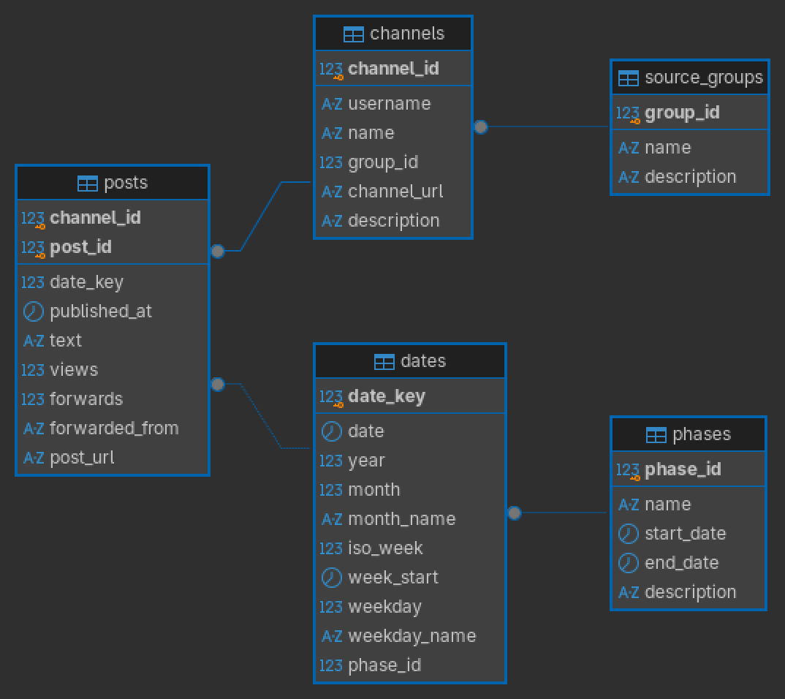
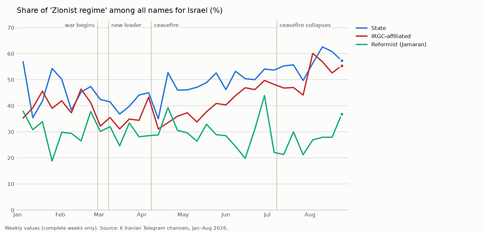

[English](README.md) | **Deutsch**

# Iranische Nachrichtenkanäle im Krieg 2026 – Telegram-Analyse mit lokaler KI

**Python · SQL · NLP · lokale KI**

Ende-zu-Ende-Projekt zur Erhebung, Aufbereitung und Auswertung von über **328.000 persischsprachigen
Telegram-Beiträgen** sechs iranischer Nachrichtenkanäle vom 1. Januar bis 31. August 2026 – dem Zeitraum
der Ende Dezember 2025 begonnenen Proteste, des Kriegs zwischen Israel/USA und Iran ab dem 28. Februar
und der folgenden Waffenruhen. Von der automatisierten Datensammlung über eine relationale Datenbank bis zur Einordnung mit
lokal betriebenen Sprachmodellen. Im Mittelpunkt steht die Methode: Wie lassen sich fremdsprachige Medien
systematisch, überprüfbar und reproduzierbar auswerten?

> **Hinweis:** Code, Methodik und Ergebnisse sind öffentlich. Die Rohtexte der Beiträge sind aus
> urheberrechtlichen Gründen nicht Teil des Repositorys; jeder Beitrag ist über Kanal und ID
> (`t.me/<kanal>/<id>`) öffentlich auffindbar.

> **Einordnung:** Das Projekt ist vor allem technisch: Datenerhebung, Aufbereitung, Auszählung und ein belastbarer
> Überblick über Wortwahl, Länder, Themen und Aktivität in sechs Kanälen. Es ist keine wissenschaftliche
> Tiefenanalyse; eine solche Studie müsste die Beiträge einzeln lesen und einordnen und würde 100 Seiten und mehr
> umfassen.
> Am besten funktioniert das Projekt als Gruppenarbeit: Die Referenz für die Prüfung der KI und das Codebuch stammen
> von **einer** Person und spiegeln ihre Sicht. Für belastbarere Ergebnisse sollten zwei bis drei persische
> Muttersprachler (z. B. Iranisten) die Beiträge unabhängig voneinander kodieren, ihre Übereinstimmung untereinander
> und mit der KI messen und die Kategorien des Codebuchs gemeinsam diskutieren. Das Codebuch lässt sich für andere
> Fragestellungen und Institutionen anpassen (z. B. Sicherheit, Politikwissenschaft, politische Interessen und
> Ideologie).

> **Wortwahl und Neutralität:** Die Auswertung bewertet nichts moralisch oder politisch. Begriffe – auch abwertende
> oder feindselige – stehen so da, wie sie in den Quellen stehen, und werden gezählt und berichtet. Sie sind die
> Wortwahl der Kanäle, nicht die Meinung des Autors; er hegt keine Feindseligkeit gegenüber Juden oder Amerikanern.
> Die Texte bleiben wissenschaftlich und technisch und folgen den Quellen.

> **Weitere Abfragen:** Um das Material für sich selbst zu verstehen, hat der Autor weitere SQL-Abfragen
> ausgeführt. Sie und die zugehörigen Daten sind nicht auf GitHub: Das Projekt ist schon sehr umfangreich, und mehr
> Material würde Leser ohne Vorkenntnis eher verwirren als ihnen helfen.

> **Kurz gelesen:** Die Ergebnisse als zweiseitiger Text ohne Diagramme und Tabellen:
> [Drei Stimmen, ein Krieg](docs/de/bericht.md)

---

## Fragestellung

Wie unterscheiden sich staatliche, IRGC-nahe und reformorientierte Nachrichtenkanäle in **Umfang,
Themenwahl, Wortwahl, Ton und Reichweite** – und wie verändern sich diese Muster rund um einschneidende
Ereignisse?

## Quellen

| Gruppe | Kanal | Telegram | Beschreibung (neutral) | Beiträge |
|---|---|---|---|---|
| 1 – staatlich / amtlich | IRNA | `@IRNA_1313` | amtliche staatliche Nachrichtenagentur, von der Regierung beaufsichtigt | 59.546 |
| 1 – staatlich / amtlich | IRIB News | `@iribnews` | Nachrichtendienst des staatlichen Rundfunks; die Leitung ernennt der Revolutionsführer | 47.698 |
| 1 – staatlich / amtlich | Mehr News | `@mehrnews` | halbamtliche Agentur der Islamic Development Organization (dem Revolutionsführer unterstellt) | 65.728 |
| 2 – IRGC-nah | Tasnim News | `@Tasnimnews` | halbamtliche Agentur, weithin als IRGC-nah beschrieben | 58.160 |
| 2 – IRGC-nah | Fars News | `@farsna` | halbamtliche Agentur, weithin als IRGC-nah beschrieben | 49.925 |
| 3 – reformorientiert | Jamaran | `@jamarannews` | Nachrichtenportal im Umfeld des Instituts für die Werke Ayatollah Khomeinis; dem Reformlager zugeordnet | 47.273 |

## Datenbasis

| | |
|---|---|
| Zeitraum | 01.01.–31.08.2026 |
| Quellen | 6 öffentliche Telegram-Kanäle in drei Quellengruppen |
| Umfang | 328.330 Beiträge |
| Sprache | Persisch |

---

## Pipeline und Stand

| Schritt | Inhalt | Status | Details |
|---|---|---|---|
| 1. Datenerhebung | Telegram-API, Qualitätsprüfung | ✅ abgeschlossen | [01 – Datenerhebung](docs/de/01_datenerhebung.md) |
| 2. Aufbereitung | PostgreSQL-Datenbank, Bereinigung persischer Texte | ✅ abgeschlossen | [02 – Aufbereitung](docs/de/02_aufbereitung.md) |
| 3. KI-Einordnung | Codebuch, Modellvergleich, Hauptlauf, Validierung | ✅ abgeschlossen | [03 – KI-Einordnung](docs/de/03_ki_einordnung.md) |
| 4. Analyse | Wortwahl, Benennungen, Zeitverlauf, Länder, Reichweite | ✅ abgeschlossen | [04 – Analyse](docs/de/04_analyse.md) |
| 5. Dashboard | lokales interaktives Dashboard | ⬜ geplant | 05 – Dashboard |
| 6. Methodik & Grenzen | Einschränkungen, Datenschutz, Sicherheit | ⬜ geplant | 06 – Methodik |

### 1. Datenerhebung
- Abruf öffentlicher Kanäle über die offizielle Telegram-API (`Telethon`)
- Pausen bei Ratenbegrenzung, separate Dateien für nachträglich ergänzte Kanäle
- Automatische Qualitätsprüfung (Vollständigkeit, Duplikate, Lücken) mit gezielter Nachprüfung auffälliger Zeiträume

### 2. Aufbereitung
- Relationale Datenbank in **PostgreSQL** (Snowflake-Schema): Beiträge, Kanäle, Quellengruppen, Tage, Phasen – Abfragen in **DBeaver**
- Vier Phasen des Zeitraums (vor dem Krieg, Krieg, Waffenruhe, nach dem Zusammenbruch der Waffenruhe) als eigene Tabelle
- Bereinigung aller 328.330 Texte: Vereinheitlichung persischer Schrift (arabische vs. persische Zeichen, Ziffern, Halbleerzeichen), Entfernen von Links, Emojis und Kanalwerbung, Entfernen von Füllwörtern – mit Prüfung in SQL



### 3. KI-Einordnung *(abgeschlossen)*
- Einordnung nach **Thema** (9 Kategorien) und **Ton** (6 Kategorien) mit **lokal betriebenen Sprachmodellen** (`Ollama`) – keine Cloud
- **Codebuch** mit operationalen Definitionen, weiterentwickelt über acht Versionen
- **Kontext:** neutrales Hintergrundwissen zu Ereignissen, Akteuren, Völkerrecht und ein Glossar persischer Begriffe
- **Modellvergleich** an 150 manuell geprüften Beiträgen: Gemma 4 (26B, 31B), Qwen 3.6 (27B, 35B), Qwen 2.5 (32B), Aya Expanse (32B)
- **Gewähltes Modell: Gemma 4 31B** – am Testset 80,7 % exakte Übereinstimmung bei Thema und Ton; Cohens Kappa Thema 0,85, Ton 0,79
- **Hauptlauf:** geschichtete Stichprobe von 10.750 Beiträgen (50 pro Kanal und Woche), gewichtet hochgerechnet
- **Endvalidierung an 200 neuen, blind kodierten Beiträgen:** Thema **72,5 %** richtig (95-%-Intervall 65,9–78,2 %), Thema und Ton 62,5 % – deutlich unter dem Testset, weil das Codebuch dort entwickelt wurde
- **Ehrliches Ergebnis:** Themen sind brauchbar (Militär eher über-, Diplomatie eher unterschätzt); den Ton übersieht die KI oft und je Gruppe verschieden stark – er wird deshalb nicht für Gruppenvergleiche verwendet
- Der ganze Weg inklusive Irrwege: [03 – KI-Einordnung](docs/de/03_ki_einordnung.md)

### 4. Analyse *(abgeschlossen)*
- Vollständiges Korpus, gezählt pro 1.000 Wörter; feste Begriffe **ohne vorgegebene Wortliste** gefunden, Korrekturen des Autors offen in einer Datei
- **Typische Begriffe** je Quellengruppe mit dem gewichteten Log-Odds-Verhältnis (Monroe et al. 2008) – ein Begriff zählt nur, wenn er für jeden Kanal der Gruppe typisch ist
- **Benennungen:** wie jede Gruppe Israel, die USA, Gegner und Personen benennt; Wörter neben Trump und Netanjahu
- **Welcher Khamenei?** Regelbasierte Zuordnung jeder Erwähnung des Führers zu Ali oder Mojtaba Khamenei, mit Stichproben geprüft
- **Zeitreihen pro Woche** rund um Schlüsselereignisse – jede Spitze erklärt mit den Begriffen, die in dieser Woche typisch waren – sowie **Aktivität und Reichweite** (Beiträge, Aufrufe, Weiterleitungen)
- **Länder und Verbündete:** 35 Länder und Gruppen (Golfstaaten, Libanon und Hisbollah, Irak, Jemen, Russland, China, Pakistan, Europa …) – wie oft, in welchen Wochen und wie jede Gruppe sie darstellt
- **Themen laut KI:** gewichtete Anteile pro Gruppe und Phase, mit gemessener Trefferquote

Ausgewählte Ergebnisse:
- **Drei Stimmen:** Staatliche Kanäle sprechen als Regierung und Verwaltung (Sprecher, Minister, Sprache des Völkerrechts – „Aggression“, „Verurteilung“); IRGC-nahe Kanäle berichten über Raketen, Drohnen, Festnahmen und „Unruhen“; Jamaran über Verhandlungen, US-Politik, Atomfrage und Internet.
- Nach dem Zusammenbruch der Waffenruhe nennen staatliche und IRGC-nahe Kanäle Israel in 57 % bzw. 53 % der Nennungen „zionistisches Regime“ (*rezhim-e sahyunisti*); Jamaran schreibt zu 70 % „Israel“.
- Kein Kanal nennt Mojtaba Khamenei vor seiner Wahl am 08.03. Führer; auch danach betreffen rund drei Viertel der Erwähnungen des Führers Ali Khamenei.
- Die höchsten Werte für „Märtyrer“ und „Rache“ liegen nicht beim Kriegsbeginn, sondern in den Wochen der Trauerfeier und der Trauerzüge für Ali Khamenei (03.–10.07.).
- Frühere Präsidenten und Minister des Reformlagers – Mohammad Khatami, Hassan Rouhani, Mohammad Javad Zarif – kommen fast nur bei Jamaran vor; Präsident Masoud Pezeshkian verschwindet im Krieg fast aus den Nachrichten.
- Mit Kriegsbeginn schrumpft die Welt auf die Region: Russland und China fallen in den IRGC-nahen Kanälen auf ein Drittel; Bahrain und Kuwait, vorher kaum genannt, werden zu Schauplätzen. Dasselbe Land sieht in jeder Gruppe anders aus – die VAE sind für die Staatsmedien ein Devisenplatz, für die IRGC-nahen Kanäle ein Angriffsziel (Hafen Fudschaira), für Jamaran ein Akteur der US-Politik.
- Themen laut KI: Im Krieg sind 36–45 % der Beiträge militärisch (vorher 4–5 %); Jamaran hat in jeder Phase den höchsten Anteil an Diplomatie.
- IRGC-nahe Kanäle erreichen pro Beitrag rund zehnmal so viele Aufrufe, werden im Verhältnis zu ihren Aufrufen aber seltener weitergeleitet.



Details, alle Diagramme und Grenzen: [04 – Analyse](docs/de/04_analyse.md)

### 5. Dashboard *(geplant)*
- Interaktive Grafiken mit `Plotly`, lokales Dashboard mit `Streamlit`

---

## Tech-Stack

| Bereich | Werkzeuge |
|---|---|
| Sprache & Umgebung | Python 3.11, conda, Linux |
| Datenerhebung | Telethon |
| Textverarbeitung | eigener Normalisierer (Regex), Füllwörter aus hazm |
| Datenbank & SQL | PostgreSQL, DBeaver |
| Analyse | pandas, numpy (Log-Odds) |
| Lokale KI | Ollama (Gemma 4, Qwen, Aya Expanse) |
| Visualisierung | matplotlib; Plotly, Streamlit (geplant) |

---

## Projektstruktur

```
telegram-iran/
├── README.md            ← englische Version
├── README.de.md         ← deutsche Version
├── docs/
│   ├── en/              ← ausführliche Seiten auf Englisch
│   └── de/              ← ausführliche Seiten auf Deutsch
├── scripts/
│   ├── telegram/        ← Login, Sammlung, Nachsammlung, Prüfung
│   ├── database/        ← PostgreSQL: Schema, Laden, Beispielabfragen, Textbereinigung, Prüfung
│   ├── ai/              ← KI-Einordnung: Konfiguration, Codebuch, Hintergrund, Modellvergleich, Hauptlauf, Validierung, Themen
│   └── analysis/        ← Wortanalyse, Benennungen, Führer, Zeitreihen, Spitzenwochen, Aktivität, Länder + zwei Listen des Autors
├── results/             ← veröffentlichte Ergebnisse, nur Zahlen (ohne Beitragstexte) – siehe results/README.md
│   ├── words/           ← Worthäufigkeiten, feste Begriffe, typische Begriffe
│   ├── leader/          ← Ali oder Mojtaba Khamenei
│   ├── naming/          ← Benennungen, Nachbarwörter
│   ├── timeline/        ← Werte pro Woche, Spitzenwochen und Diagramme
│   ├── activity/        ← Beiträge, Aufrufe, Weiterleitungen und Diagramme
│   ├── countries/       ← Länder und Verbündete: Häufigkeit, Spitzenwochen, Darstellung, Diagramme
│   └── ai/              ← KI: Modellvergleich, Hauptlauf, Endvalidierung, Themen (ohne Texte)
└── data/                ← Rohdaten (nicht im Repository)
```

---

## Datenschutz & Methodik

- ausschließlich **öffentlich zugängliche** redaktionelle Veröffentlichungen
- **keine personenbezogenen Daten** von Nutzern, keine privaten Gruppen oder Kommentare
- Verarbeitung vollständig **lokal**, auch die KI-Einordnung
- Zugangsdaten nur als Umgebungsvariablen; Rohdaten und Sitzungsdateien vom Repository ausgeschlossen
- KI-Ergebnisse werden nicht ungeprüft übernommen, sondern an neuen, blind kodierten Beiträgen validiert – mit Konfidenzintervall

## Kompetenzen, die das Projekt zeigt

- Datenerhebung über APIs, inklusive Fehlerbehandlung und Ratenbegrenzung
- Datenqualität: systematische Prüfung, Umgang mit Lücken, Dokumentation von Einschränkungen
- Verarbeitung nicht-lateinischer Schriften
- Textanalyse ohne vorgegebene Wortlisten; statistischer Vergleich von Gruppen (Log-Odds, z-Werte)
- SQL und relationale Datenbanken
- Einsatz und **Validierung** lokaler KI: Codebuch-Entwicklung, Modellvergleich, messbare Experimente
- Quellenkritische Auswertung fremdsprachiger Medien

## Status

In Bearbeitung – die Seiten unter `docs/` werden nach jedem abgeschlossenen Schritt ergänzt.

---

## Position des Autors

Ich lehne Krieg und Gewalt gegen Menschen ab, unabhängig davon, von welcher Seite sie ausgehen. Dieses Projekt
bezieht keine politische Position: Es beschreibt, wie Medien berichten, nicht, wer recht hat. Alle Quellen werden
nach denselben Regeln ausgewertet. In der Auswertung verwende ich für Ereignisse wie die Tötung von Politikern und
Militärs neutrale Begriffe („getötet“). Wie unterschiedlich Medien und Staaten solche Taten benennen – etwa als
„Eliminierung“, „gezielte Tötung“ oder „Terror“ –, ist selbst Gegenstand der Analyse.

Kein Mensch darf getötet werden – auch nicht hochrangige Politiker und Generäle der Islamischen Republik Iran, und
schon gar nicht in ihren Wohnhäusern, gemeinsam mit ihren Familien. Dieses Projekt ist
deshalb kein Ort für Sprache, die solche Tötungen verharmlost oder rechtfertigt, auch nicht durch Begriffe wie
„Eliminierung“.
