[English](../en/04_analysis.md) | **Deutsch**

# 04 – Analyse: Was die Kanäle sagen, wen sie nennen und wie sie benennen

[← zurück zur Übersicht](../../README.de.md)

Diese Seite zeigt die Ergebnisse der Auswertung des **vollständigen Korpus** – mit Zählungen und Statistik
in Python. Sie beantwortet fünf Fragen:

1. **Worüber** schreibt jede Quellengruppe deutlich mehr als die anderen?
2. **Wen** nennen sie – und wie oft?
3. **Wie benennen** sie dieselben Akteure (Israel, die USA, Gegner im Inneren)?
4. **Wann** ändert sich das – und welches Ereignis steckt hinter jeder Spitze?
5. **Welche Länder und Verbündeten** nennen sie – wann und in welchem Zusammenhang?

Die Methode steht am Ende der Seite ([Abschnitt 10](#10-methode)). Abschnitt 7 ergänzt die Themen laut
KI-Einordnung einer gewichteten Stichprobe ([03](03_ki_einordnung.md)) – mit gemessener Trefferquote.

| | |
|---|---|
| Grundlage | 328.330 Beiträge von 6 Kanälen, davon 267.548 mit Text; 01.01.–31.08.2026 |
| Gruppen | **staatlich**: IRNA, IRIB News, Mehr News · **IRGC-nah**: Tasnim News, Fars News · **reformorientiert**: Jamaran |
| Einheit | Häufigkeit **pro 1.000 Wörter** – so sind Gruppen unterschiedlicher Größe vergleichbar |
| Schreibweise | persische Begriffe mit Umschrift und Übersetzung: `رژیم صهیونیستی` *rezhim-e sahyunisti* („zionistisches Regime“) |
| Ergebnisdateien | nur Zahlen, in `results/` – keine Beitragstexte ([Beschreibung](../../results/README.md)) |

### Zeitleiste

Die Daten der Ereignisse stammen aus dem recherchierten Hintergrund des Projekts (`scripts/ai/background.txt`);
die Daten der Trauerfeier aus Berichten von Al Jazeera.

| Datum | Ereignis |
|---|---|
| 28.12.2025 – Mitte Jan. | landesweite Proteste wegen der Wirtschaftslage; ab **08.01.** Internetsperre |
| 06.02., 17.02., 26.02. | Atomgespräche USA–Iran in Maskat und Genf, vermittelt von Oman; keine Einigung |
| **28.02.** | Angriffe der USA und Israels auf Iran, **Ali Khamenei getötet**; Iran greift Israel und US-Stützpunkte in den Golfstaaten an; Angriff auf die Grundschule Schadschareh Tayyebeh in **Minab** (ca. 156 Tote, davon ca. 120 Kinder) |
| 01.03. | Tod Ali Khameneis in Iran offiziell bestätigt |
| 02.03. | Hisbollah tritt in den Krieg ein |
| **08.03.** | Expertenversammlung wählt **Mojtaba Khamenei** zum Revolutionsführer |
| 17.03. | Ali Larijani (Sekretär des Nationalen Sicherheitsrats) getötet |
| **08.04.** | **Waffenruhe** USA–Iran, vermittelt von Pakistan; 11.–12.04. Gespräche in **Islamabad** ohne Einigung |
| 13.04. | US-Seeblockade gegen iranische Schiffe |
| 17.–18.06. | **„Islamabad-Memorandum“**: 60 Tage Verhandlungen, Durchfahrt durch Hormus, Zeitplan für das Ende der Blockade |
| **03.–10.07.** | **Trauerfeier und Trauerzüge für Ali Khamenei**: Staatsakt 03.07., Gebetsstätte (Mosalla) Teheran ab 04.07., Trauerzug Teheran 06.07., Ghom 07.07., Nadschaf und Kerbela 08.07., Maschhad 09.07., Beisetzung 10.07. – in den Daten deutlich sichtbar, siehe [Abschnitt 5](#5-zeitverlauf-was-wann-geschah) |
| **07.–08.07.** | Angriffe auf Handelsschiffe bei Hormus, erneute US-Angriffe – **Zusammenbruch der Waffenruhe** |
| 13.–14.07. | Seeblockade wieder in Kraft |
| 10.08. | Mojtaba Khamenei baut die Militärführung um |
| 24.08. | neue US-Sanktionen; der Rial fällt auf ein Rekordtief (ca. 2 Mio. pro US-Dollar) |

---

## Die wichtigsten Ergebnisse

- **Drei verschiedene Stimmen.** Die staatlichen Kanäle sprechen als **Regierung und Verwaltung**: Außenamtssprecher,
  Minister, Provinzbehörden – und die Sprache des Völkerrechts („Aggression“, „Verurteilung“, „UN-Menschenrechte“).
  Die IRGC-nahen Kanäle berichten über **Raketen, Drohnen, Festnahmen und „Unruhen“** und mobilisieren („Treueeid“,
  „Blutrache“). Jamaran berichtet über **Verhandlungen, US-Politik, Atomfrage, Internet** – und zitiert internationale
  Medien und Reformpolitiker.
- **Israel heißt immer öfter „zionistisches Regime“** – bei staatlichen und IRGC-nahen Kanälen nach dem Zusammenbruch
  der Waffenruhe in 57 % bzw. 53 % der Nennungen (vorher 42–48 % bzw. 35–40 %). Jamaran schreibt zu 70 % „Israel“.
- **Jamaran nennt Trump am häufigsten und schreibt am häufigsten „Trump behauptet“** (8,2 % aller Wörter direkt nach
  „Trump“, bei den anderen 3 %). IRGC-nahe Kanäle nennen ihn häufiger „Verbrecher“ und „Glücksspieler“.
- **Mojtaba Khamenei wird von keinem Kanal vor seiner Wahl am 08.03. „Führer“ genannt.** Trotzdem betreffen danach
  rund **drei Viertel** aller Erwähnungen des Führers den getöteten Ali Khamenei.
- **Personen:** Präsident Pezeshkian verschwindet im Krieg fast aus den Nachrichten (IRGC-nah von 0,60 auf 0,17 pro
  1.000 Wörter). Parlamentspräsident **Ghalibaf** gewinnt in der Waffenruhe an Gewicht. Frühere Präsidenten und
  Minister des Reformlagers – **Khatami, Rouhani, Zarif** – kommen fast nur bei Jamaran vor.
- **Die größten Ausschläge liegen nicht beim Kriegsbeginn**, sondern Anfang Juli: In den Wochen der
  Trauerfeier für Ali Khamenei erreichen „Märtyrer“ und „Rache“ ihre höchsten Werte – IRGC-nah 21,6 Mal „Märtyrer“
  pro 1.000 Wörter, zehnmal so viel wie sonst.
- **Jede Spitze lässt sich datieren:** „Verhandlungen“ steigt in den Wochen von Maskat (06.02.), Islamabad (08.–12.04.)
  und dem Memorandum (17.–18.06.); Gegnerbegriffe in den Wochen der Proteste und der Internetsperre im Januar.
- **Länder:** Mit Kriegsbeginn schrumpft die Welt auf die Region – Russland und China fallen in den IRGC-nahen Kanälen
  auf ein Drittel, Gaza in allen Gruppen auf ein Fünftel bis ein Drittel. Bahrain und Kuwait, vorher kaum genannt, werden zu
  Schauplätzen. Jede Phase hat ihr Land: Libanon und Pakistan in der Waffenruhe, Saudi-Arabien, Jemen und Irak danach.
- **Dasselbe Land, drei Bilder:** Die VAE sind für die Staatsmedien ein Devisenplatz, für die IRGC-nahen Kanäle ein
  Angriffsziel (Hafen Fudschaira), für Jamaran ein Akteur der US-Politik. Saudi-Arabien ist für die Staatsmedien
  Gesprächspartner, für die IRGC-nahen Kanäle der Gegner im Jemen.
- **Themen laut KI:** Im Krieg sind 36–45 % der Beiträge militärisch (vorher 4–5 %). Jamaran hat in jeder Phase den
  höchsten Anteil an Diplomatie. Trefferquote der KI beim Thema: 72,5 %; den Ton misst die KI nicht verlässlich genug
  für Vergleiche zwischen Gruppen.
- **Reichweite:** Tasnim und Fars erreichen pro Beitrag rund **zehnmal so viele Aufrufe** wie die anderen Kanäle.

---

## 1. Worüber jede Gruppe schreibt

Welche Begriffe verwendet eine Gruppe **deutlich häufiger** als die beiden anderen? Gemessen mit dem gewichteten
Log-Odds-Verhältnis; ein Begriff zählt nur, wenn **jeder** Kanal der Gruppe ihn häufiger verwendet
(Methode: [Abschnitt 10](#10-methode)). Die Stärke des Unterschieds ist der z-Wert – ab 2 ist er statistisch deutlich,
über 10 sehr stark. Die folgenden Tabellen ordnen die 200 typischsten Begriffe jeder Gruppe nach Themen; vollständige
Listen in `results/words/typical_terms.xlsx`.

### Staatliche Kanäle – die Stimme von Regierung und Verwaltung

Die Spitze der Rangliste bilden Alltagswörter der Verwaltung: Provinzen, Monatsnamen, Wochentage. Das liegt daran, dass
die drei staatlichen Kanäle täglich Service-Meldungen veröffentlichen. Darunter liegt die politische Stimme – schwächer
(z 3–9), aber in allen drei Kanälen eindeutig:

| Thema | typische Begriffe | z |
|---|---|---|
| Regierungssprecher und Diplomatie | `بقائی` *Baghaei* (Esmail Baghaei, Sprecher des Außenministeriums) · `وزیر امور خارجه` *vazir-e omur-e kharejeh* (Außenminister) · `غریب‌آبادی` *Gharibabadi* (Kazem Gharibabadi, Vize-Außenminister) · `مهاجرانی` *Mohajerani* (Fatemeh Mohajerani, Regierungssprecherin) · `مجلس شورای اسلامی` *majles* (Parlament) | 3–9 |
| Sprache des Völkerrechts | `تجاوز` *tajavoz* (Aggression) · `محکوم` / `محکومیت` *mahkum* (verurteilt / Verurteilung) · `نقض` *naqz* (Verletzung) · `سازمان ملل` *sazman-e melal* (Vereinte Nationen) · `حقوق بشر سازمان ملل` *hoquq-e bashar* (UN-Menschenrechtsrat) · `جنایت` *jenayat* (Verbrechen) · `جنگ تحمیلی` *jang-e tahmili* („aufgezwungener Krieg“) | 3–6 |
| Justiz | `محسنی اژه‌ای` *Mohseni-Ejei* (Gholam-Hossein Mohseni-Ejei, Chef der Justiz) | 3,5 |
| Militärische Erklärungen | `بسم الله قاصم الجبارین` *besmellah qasem al-jabbarin* („im Namen Gottes, der die Tyrannen zerschmettert“ – Überschrift militärischer Erklärungen) · `قاتلوهم` *qatiluhum* („kämpft gegen sie“, Koranvers) | 3–5 |
| Bildung | `دانش آموزان` *daneshamuzan* (Schüler) · `سازمان سنجش آموزش کشور` (Prüfungsbehörde) · `آزمون` (Prüfung) · `رشته` (Studienfach) · `کلاس درس` (Schulklasse) | 3–6 |
| Verwaltung und Service | `استان` *ostan* (Provinz) · `مدیرکل` *modir-kol* (Generaldirektor) · `راهداری` (Straßenbehörde) · `سازمان هواشناسی` (Wetterdienst) · `زلزله` (Erdbeben) · `جمعیت هلال احمر` (Roter Halbmond) | 4–11 |
| Kalender | Monatsnamen `اردیبهشت` *ordibehesht*, `خرداد` *khordad*, `تیر` *tir*, `مرداد` *mordad*, `شهریور` *shahrivar* · Wochentage | 4–11 |
| Kultur, Sport, Religion | `جشنواره فیلم فجر` (Fadschr-Filmfestival) · Taekwondo, Ringen · `اربعین` *arbain* (Pilgerfahrt nach Kerbela) | 4–5 |

**Die drei staatlichen Kanäle unterscheiden sich** (Vergleich jedes Kanals mit den fünf anderen):
IRNA schreibt über Regierung, Wirtschaft und Kultur (`دولت چهاردهم` „14. Regierung“ = Regierung Pezeshkian, Gold,
Tourismus, Theater). IRIB News warnt im Krieg (`آژیرها` Sirenen, `هشدار نارنجی` „oranger Alarm“, `پناهگاه بروند`
„geht in die Schutzräume“) und berichtet über `تجمعات شبانه` (nächtliche regierungsnahe Kundgebungen).
Mehr News ist der Kanal der Trauer und Mobilisierung: `سوگ` (Trauer), `مراسم تشییع پیکر` (Trauerzug), `رهبر شهید`
(der Märtyrer-Führer), `میناب` (Minab), `جنگ رمضان` *jang-e ramazan* („Ramadan-Krieg“ – der Krieg begann im Ramadan).

### IRGC-nahe Kanäle – Krieg, Sicherheit und Mobilisierung

| Thema | typische Begriffe | z |
|---|---|---|
| Waffen und Angriffe | `پهپاد` *pahpad* (Drohne) · `موشک` *mushak* (Rakete) · `پهپاد انتحاری` (Kamikaze-Drohne) · `هدف قرار` (ins Ziel genommen) · `اصابت` (Einschlag) · `انهدام` (Zerstörung) | 7–15 |
| Ziele in Israel und am Golf | `حیفا` (Haifa) · `الجلیل` (Galiläa) · `کریات شمونه` (Kiryat Schmona) · `فلسطین اشغالی` *felestin-e eshghali* („besetztes Palästina“ = Israel) · `فجیره` (Fudschaira, VAE) · `اربیل` (Erbil, Irak) · Saudi-Arabien, VAE, Kuwait, Bahrain | 5–11 |
| Verbündete | `حزب‌الله` *Hezbollah* (Hisbollah) – der typischste Begriff der Gruppe (z 20,8) · `یمن` (Jemen) · `النبطیه` (Nabatieh, Südlibanon) | 5–21 |
| Proteste als „Unruhen“ | `اغتشاشات` *eghteshashat* („Unruhen“) · `اغتشاشگران` („Randalierer“) · `آشوبگران` („Aufrührer“) · `ضدانقلاب` („Konterrevolution“) · `منافقین` („Heuchler“ = Volksmudschahedin) · `کشته‌سازی` *koshteh-sazi* („inszenierte Todesfälle“) | 6–14 |
| Sicherheit und Festnahmen | `دستگیر` (festgenommen) · `بازداشت` (Haft) · `کشف` (entdeckt) · `عناصر` („Elemente“) · `تروریست` (Terrorist) · `سازمان اطلاعات سپاه` (Geheimdienst der Revolutionsgarde) | 5–12 |
| Opposition im Ausland | `اینترنشنال` (Iran International, persischsprachiger Sender im Ausland) · `رضا پهلوی` *Reza Pahlavi* (Sohn des letzten Schahs) | 10–12 |
| Mobilisierung und Religion | `بیعت` *bey'at* (Treueeid – vor allem im Krieg, nach der Wahl des neuen Führers) · `خونخواهی` *khunkhahi* (Blutrache) · `انتقام` *enteqam* (Rache) · `لبیک` („zu Diensten“) · `مداحی` (religiöser Trauergesang) · `حرم حضرت معصومه` (Schrein in Qom) · `خیابان`, `تجمع` (Straße, Kundgebung) | 5–13 |
| Getötete Kommandeure | `شهید پاکپور` (Mohammad Pakpour, Kommandeur der Revolutionsgarde, getötet 28.02.) · `شهید سلامی` (Hossein Salami, getötet 2025) · `غلامرضا سلیمانی` (Basij-Kommandeur, getötet 17.03.) · `شهید رئیسی` (Ebrahim Raisi, Präsident, 2024 verunglückt) | 5–7 |
| Fußball | `پرسپولیس` (Persepolis) · `استقلال` (Esteghlal) · `تراکتور` (Tractor) | 6–9 |

Tasnim ist geprägt von Beisetzungen (`بدرقه` Geleit, `شهید` Märtyrer) und dem Libanon; Fars von Einschlägen,
Justiz und Banken.

### Jamaran – Diplomatie, Atomfrage und Reformlager

| Thema | typische Begriffe | z |
|---|---|---|
| USA und Verhandlungen | `ترامپ` *Trump* – der typischste Begriff (z 44,6) · `ایالات متحده` (Vereinigte Staaten) · `مذاکرات` (Verhandlungen) · `توافق` (Abkommen) · `ونس` (JD Vance) · `روبیو` (Marco Rubio) · `ویتکاف` (Steve Witkoff) · `کوشنر` (Jared Kushner) · `برجام` (Atomabkommen 2015) | 9–45 |
| Atomfrage | `هسته‌ای` (nuklear) · `غنی‌سازی` (Anreicherung) · `اورانیوم` (Uran) · `گروسی` (Rafael Grossi, Chef der IAEA) | 10–23 |
| Distanz zur Aussage | `مدعی` *moddai* („behauptet“) · `ادعای` („Behauptung“) · `احتمالا` (wahrscheinlich) · `بعید` (unwahrscheinlich) · `ظاهرا` (anscheinend) | 8–33 |
| Internationale Medien | `آکسیوس` (Axios) · CNN · Fox News · New York Times · Wall Street Journal · Bloomberg · Reuters · Al Jazeera · RIA Nowosti | 9–22 |
| Reformlager | `سید حسن خمینی` (Hassan Khomeini, Enkel des Revolutionsgründers) · `خاتمی` (Mohammad Khatami, Präsident 1997–2005) · `ظریف` (Mohammad Javad Zarif, Außenminister 2013–2021) · `حسن روحانی` (Hassan Rouhani, Präsident 2013–2021) · `ابطحی` (Mohammad-Ali Abtahi, Vizepräsident unter Khatami) · `زیدآبادی` (Ahmad Zeidabadi, Journalist) · `عارف` (Mohammad Reza Aref, Erster Vizepräsident) · `اصلاحات` (Reformen) | 10–28 |
| Gegner im Inland | `کیهان` (Kayhan, konservative Zeitung) · `شریعتمداری` (Hossein Shariatmadari, Chefredakteur von Kayhan) · `نبویان` (Mahmoud Nabavian, Abgeordneter) · `اصولگرا` (Prinzipalisten) · `تندروها` (Hardliner) | 9–15 |
| Internet und Gesellschaft | `اینترنت` (Internet, z 39,1) · `فیلترینگ` (Sperren) · `فیلترشکن` (VPN) · `اینترنت پرو` („Internet Pro“ – gesonderter Internetzugang) · `حجاب` (Kopftuch) · `طبقاتی` (Klassen-) | 9–39 |
| Nachrufe | `مرحوم` (der Verstorbene) · `درگذشت` (ist verstorben) · `تسلیت` (Beileid) | 9–13 |

---

## 2. Wen die Kanäle nennen

Nennungen pro 1.000 Wörter, ganzer Zeitraum. Gezählt werden Name und Namensvarianten
(`naming_terms.csv`, z. B. `محمدباقر قالیباف` *Mohammad-Bagher Ghalibaf* und `قالیباف` *Ghalibaf*).

| Persisch | Person | Rolle | staatlich | IRGC-nah | Jamaran |
|---|---|---|---|---|---|
| `ترامپ` | Donald Trump | Präsident der USA | 1,86 | 2,06 | **3,11** |
| `نتانیاهو` | Benjamin Netanjahu | Ministerpräsident Israels | 0,31 | 0,38 | **0,50** |
| `پزشکیان` | Masoud Pezeshkian | Präsident Irans (seit 2024) | 0,42 | 0,35 | **0,56** |
| `عراقچی` | Abbas Araghchi | Außenminister (seit 2024) | **0,48** | 0,43 | 0,46 |
| `بقائی` | Esmail Baghaei | Sprecher des Außenministeriums | **0,28** | 0,14 | 0,13 |
| `قالیباف` | Mohammad Bagher Ghalibaf | Parlamentspräsident (seit 2020); früher Kommandeur der Luftwaffe der Revolutionsgarde, Polizeichef und Bürgermeister von Teheran | 0,23 | **0,32** | 0,27 |
| `ظریف` | Mohammad Javad Zarif | Außenminister 2013–2021 | 0,01 | 0,01 | **0,06** |
| `خاتمی` | Mohammad Khatami | Präsident 1997–2005, Reformlager | 0,01 | 0,02 | **0,12** |
| `حسن روحانی` | Hassan Rouhani | Präsident 2013–2021 | 0,00 | 0,00 | **0,03** |
| `احمدی‌نژاد` | Mahmoud Ahmadinejad | Präsident 2005–2013 | 0,00 | 0,00 | **0,02** |

In absoluten Zahlen: Khatami 366-mal bei Jamaran gegenüber 122-mal in allen drei staatlichen Kanälen zusammen;
Rouhani 78 gegenüber 30 und 16. Rouhani wird nur mit vollem Namen gezählt, weil `روحانی` allein auch „Geistlicher“
heißt.

**Wer wann wichtig ist** (pro 1.000 Wörter nach Phase, `naming.xlsx`, Blatt `persons_phases`):

| | vor dem Krieg | Krieg | Waffenruhe | nach dem Zusammenbruch |
|---|---|---|---|---|
| Pezeshkian, IRGC-nah | 0,60 | **0,17** | 0,37 | 0,37 |
| Pezeshkian, staatlich | 0,55 | **0,26** | 0,39 | 0,50 |
| Araghchi, alle drei Gruppen | **0,68–0,76** | 0,36–0,48 | 0,41–0,47 | 0,30–0,38 |
| Ghalibaf, IRGC-nah | 0,20 | 0,23 | **0,43** | 0,28 |
| Ghalibaf, Jamaran | 0,10 | 0,15 | **0,39** | 0,32 |
| Khatami, Jamaran | 0,08 | 0,03 | 0,13 | **0,22** |

- Der **Präsident** tritt im Krieg in den Hintergrund – am stärksten in den IRGC-nahen Kanälen.
- Der **Außenminister** ist vor dem Krieg am präsentesten, in der Zeit der Atomgespräche.
- **Ghalibaf** wird in der Waffenruhe doppelt bis viermal so oft genannt wie vor dem Krieg.

### Ghalibaf im Zeitverlauf

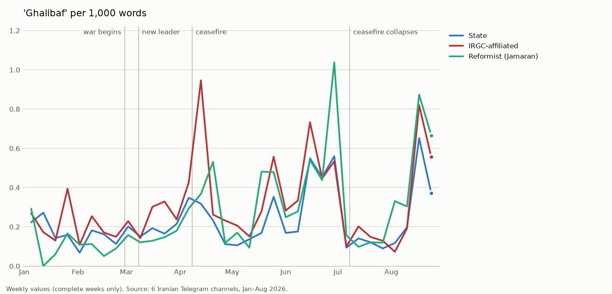

Die Spitzen fallen auf drei Ereignisse. Rechts stehen die Begriffe, die in der jeweiligen Woche insgesamt am
typischsten waren (`11_peak_weeks.py`, siehe [Abschnitt 5](#5-zeitverlauf-was-wann-geschah)):

| Woche ab | höchster Wert | typische Begriffe dieser Woche | Ereignis |
|---|---|---|---|
| 13.04. | IRGC-nah 0,95 | `آتش‌بس` *atash-bas* (Waffenruhe) · `محاصره دریایی` *mohasereh-ye darya'i* (Seeblockade) · `مذاکرات` *mozakerat* (Verhandlungen) · `تنگه هرمز` (Straße von Hormus) | Gespräche in Islamabad (11.–12.04.), US-Seeblockade (13.04.) |
| 29.06. | Jamaran 1,04 · staatlich 0,56 | `مراسم وداع` *marasem-e veda'* (Abschiedsfeier) · `رهبر شهید` *rahbar-e shahid* (der Märtyrer-Führer) · `مصلی تهران` *mosalla* (Gebetsstätte Teheran) · `ادای احترام` (Ehrerweisung) | Trauerfeier für Ali Khamenei |
| 17.08. | Jamaran 0,87 · IRGC-nah 0,82 · staatlich 0,65 | `چهلم` *chehelom* (Gedenkfeier am 40. Tag) · `تدفین` *tadfin* (Beisetzung) · `اقتصادی` (wirtschaftlich) · `بنزین` *benzin* (Benzin) · `نفوذ` *nofuz* („Unterwanderung“) · `مصدق` *Mosaddegh* (Jahrestag des Putsches vom 19.08.1953) | Gedenkfeiern für Ali Khamenei; Debatten über Wirtschaft und Benzin |

Ghalibaf wird also in drei ganz verschiedenen Zusammenhängen häufig genannt: bei den Verhandlungen, bei der Trauer um
den Führer und in der Wirtschaftspolitik danach. Die Begriffe zeigen den Zusammenhang der Woche, nicht jede
einzelne Aussage über ihn; den genauen Inhalt zeigt `04_context.py قالیباف`.

### Welche Wörter neben Trump stehen

| Wort direkt nach „Trump“ | staatlich | IRGC-nah | Jamaran |
|---|---|---|---|
| `مدعی` *moddai* („behauptet“) | 2,8 % | 3,0 % | **8,2 %** |
| `جنایتکار` *jenayatkar* („Verbrecher“) | 0,5 % | **1,4 %** | – |
| `قمارباز` *qomarbaz* („Glücksspieler“) | – | **0,6 %** | – |

Anteil an allen Wörtern direkt nach „Trump“; „–“ = nicht unter den 20 häufigsten. Vor „Trump“ steht bei allen am
häufigsten `دونالد` (Donald), danach `دولت` (Regierung) und `ادعای` („die Behauptung von“) – bei Jamaran 5,2 %, bei den
anderen 3,2–3,3 %. Vor „Netanjahu“ steht in allen Gruppen `توهمات` (*tavahhomat*, „Wahnvorstellungen“).
Vollständige Listen: `results/naming/neighbours.csv`.

---

## 3. Wie die Kanäle benennen

### Israel

Anteil an allen Bezeichnungen für Israel:

| | staatlich | IRGC-nah | Jamaran |
|---|---|---|---|
| `رژیم صهیونیستی` *rezhim-e sahyunisti* („zionistisches Regime“), ganzer Zeitraum | 48 % | 40 % | 29 % |
| – vor dem Krieg (bis 27.02.) | 46 % | 40 % | 28 % |
| – Krieg (28.02.–07.04.) | 42 % | 35 % | 31 % |
| – Waffenruhe (08.04.–07.07.) | 48 % | 40 % | 29 % |
| – nach dem Zusammenbruch (ab 08.07.) | **57 %** | **53 %** | 26 % |
| `اسرائیل` *Esra'il* („Israel“), ganzer Zeitraum | 45 % | 50 % | **65 %** |
| `صهیونیست‌ها` *sahyunist-ha* („die Zionisten“) | 4 % | **6 %** | 3 % |

- Nach dem 08.07. verwenden staatliche und IRGC-nahe Kanäle „zionistisches Regime“ deutlich häufiger; Jamaran nicht.
- Für israelisches Staatsgebiet schreiben IRGC-nahe Kanäle öfter `فلسطین اشغالی` *felestin-e eshghali*
  („besetztes Palästina“, 10 % gegenüber 3 % bei Jamaran).

### USA

- `آمریکا` *Amrika* („Amerika“) ist überall die Hauptbezeichnung (76–84 %).
- Jamaran schreibt öfter die formale Bezeichnung `ایالات متحده` *Eyalat-e Mottahedeh* („Vereinigte Staaten“):
  11 % gegenüber 7 % (staatlich) und 5 % (IRGC-nah).
- Abwertende Bezeichnungen wie `ارتش تروریستی آمریکا` („terroristische Armee Amerikas“) und `ارتش کودک‌کش آمریکا`
  („kindermordende Armee Amerikas“) nehmen nach dem Zusammenbruch der Waffenruhe deutlich zu: zusammen 3–5 % aller
  Bezeichnungen für die USA, im Krieg 1–2 %, vor dem Krieg 0 %.
- `رئیس دولت تروریستی آمریکا` („Chef der terroristischen Regierung Amerikas“ – für Trump) verwendet vor allem Tasnim.

### Rache, Gegner, Verbrechen, Diplomatie

Pro 1.000 Wörter, ganzer Zeitraum:

| Begriffsgruppe | Beispiele | staatlich | IRGC-nah | Jamaran |
|---|---|---|---|---|
| Diplomatie | `مذاکره` *mozakereh* (Verhandlung) · `توافق` *tavafoq* (Abkommen) · `آتش‌بس` *atash-bas* (Waffenruhe) · `صلح` *solh* (Frieden) | 3,88 | 3,04 | **5,39** |
| Verbrechen | `جنایت` *jenayat* (Verbrechen) · `نسل‌کشی` *nasl-koshi* (Völkermord) · `کودک‌کش` *kudak-kosh* (Kindermörder) · `میناب` (Minab) | **1,03** | 0,90 | 0,75 |
| Gegner im Inland | `مزدور` *mozdur* (Söldner) · `خائن` *kha'en* (Verräter) · `اغتشاشگر` *eghteshashgar* (Randalierer) · `وطن‌فروش` *vatan-forush* (Landesverräter) · `ضدانقلاب` (Konterrevolution) | 0,25 | **0,48** | 0,22 |
| Rache | `انتقام` *enteqam* (Rache) · `خونخواهی` *khunkhahi* (Blutrache) · `قصاص` *qesas* (Vergeltung) · `انتقام سخت` („harte Rache“) | 0,20 | **0,32** | 0,12 |

- Rund ein Drittel der Verbrechensbegriffe betrifft den Angriff auf die Schule in **Minab** (32–37 %).
- Bei Jamaran ist „Blutrache“ selten (16 % der Rachebegriffe gegenüber 34–35 %).

---

## 4. Welcher Khamenei ist gemeint?

`خامنه‌ای` *Khamenei* und `رهبر` *rahbar* („der Führer“) können Ali Khamenei (getötet am 28.02.) oder seinen Sohn
und Nachfolger Mojtaba Khamenei meinen. Jede Erwähnung wurde mit Regeln zugeordnet und mit Stichproben geprüft
(Methode: [Abschnitt 10](#10-methode)).

- Alle sechs Kanäle schreiben zum ersten Mal am **01.03.** `رهبر شهید` *rahbar-e shahid* („der Märtyrer-Führer“) –
  dem Tag, an dem der Tod offiziell bestätigt wurde.
- Alle sechs Kanäle nennen Mojtaba Khamenei zum ersten Mal am **08.03.** in einem Satz mit „Führer“ – am Tag seiner
  Wahl, **kein Kanal früher**. Jamaran und Mehr nennen seinen Namen ab dem 03.03., Tasnim ab dem 05.03. – noch nicht
  als Führer.
- Danach bleibt der getötete Führer präsenter als der neue:

| Phase | Ali Khamenei | Mojtaba Khamenei | beide |
|---|---|---|---|
| Krieg (28.02.–07.04.) | 55 % | 35 % | 10 % |
| Waffenruhe | 74 % | 22 % | 4 % |
| nach dem Zusammenbruch der Waffenruhe | 79 % | 17 % | 3 % |

22.897 Beiträge, alle sechs Kanäle; pro Kanal in `results/leader/leader_mentions.xlsx`. Am meisten über Mojtaba
berichten im Krieg Fars (45 %) und IRIB News (42 %).

---

## 5. Zeitverlauf: was wann geschah

Die Diagramme zeigen die Begriffe pro **Kalenderwoche** (jeder Punkt = eine Woche, nicht aufsummiert). Senkrechte Linien:
Kriegsbeginn (28.02.), neuer Führer (08.03.), Waffenruhe (08.04.), Zusammenbruch der Waffenruhe (08.07.). Die erste und
die letzte Woche sind unvollständig und fehlen in den Diagrammen.

**Warum gibt es eine Spitze?** `11_peak_weeks.py` vergleicht jede Spitzenwoche mit allen anderen Wochen derselben
Gruppe und listet die Begriffe, die **in genau dieser Woche** typisch waren (gleiche Methode wie Abschnitt 1). So lässt
sich jede Spitze mit den Daten selbst einem Ereignis zuordnen. Die Begriffe beschreiben die ganze Woche, nicht nur die
Beiträge mit dem gezählten Wort. Alle Wochen und Begriffe: `results/timeline/peak_weeks.csv`.

### Verhandlungen

| Woche ab | Spitze (pro 1.000 Wörter) | typische Begriffe dieser Woche | Ereignis |
|---|---|---|---|
| 02.02. | Jamaran 6,2 · staatlich 3,7 · IRGC-nah 3,5 | `مسقط` *Masqat* (Maskat) · `عراقچی` (Abbas Araghchi) · `ویتکاف` (Steve Witkoff) | Atomgespräche in Maskat (06.02.) |
| 06.04. | Jamaran 4,4 · IRGC-nah 3,5 · staatlich 3,0 | `آتش‌بس` (Waffenruhe) · `اسلام‌آباد` (Islamabad) · `پاکستان` (Pakistan) · `لبنان` (Libanon) · `چهلمین روز شهادت` (40. Tag nach dem Tod Ali Khameneis) · `خرازی` (Kamal Kharazi, früherer Außenminister, gest. 09.04.) | Waffenruhe (08.04.), Gespräche in Islamabad (11.–12.04.) |
| 15.06. | Jamaran 4,1 · IRGC-nah 2,9 | `تفاهم‌نامه` *tafahom-nameh* (Memorandum) · `امضای` (Unterzeichnung) · `محرم` (Monat Muharram) | „Islamabad-Memorandum“ (17.–18.06.) |

Jamaran schreibt in jeder dieser Wochen am meisten über Verhandlungen. Nach dem Zusammenbruch der Waffenruhe bleibt
der Wert bei Jamaran mehr als doppelt so hoch wie bei den anderen Gruppen (1,39 gegenüber 0,59 und 0,62).

### Waffenruhe und Trump

| Woche ab | typische Begriffe dieser Woche | Ereignis |
|---|---|---|
| 06.04. | Waffenruhe · Islamabad · Pakistan | Waffenruhe tritt in Kraft (08.04.) |
| 13.04. | `محاصره دریایی` (Seeblockade) · `تنگه هرمز` (Straße von Hormus) · `پاپ لئو` (Papst Leo) · `ترامپ` (Trump) | US-Seeblockade (13.04.) – höchster Wert für „Trump“ in allen Gruppen (Jamaran 4,5, IRGC-nah 4,0, staatlich 3,4) |
| 20.04. | `تمدید` *tamdid* (Verlängerung) · Waffenruhe · Seeblockade | Trump verlängert die Waffenruhe (21.04.) |

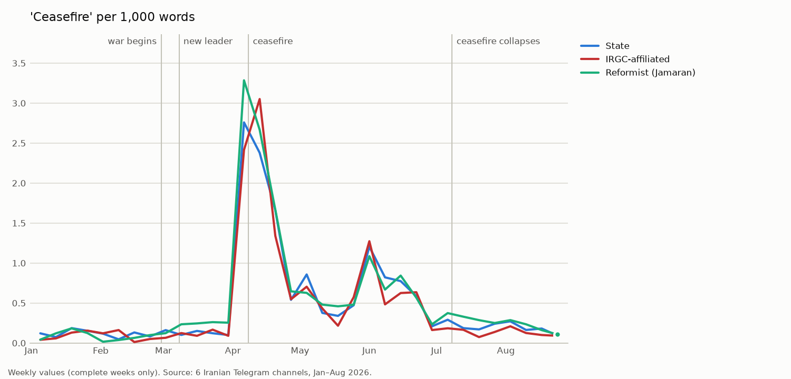

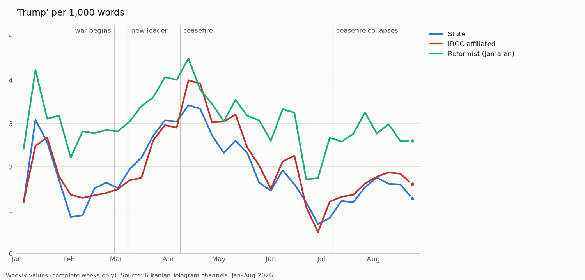

Trump wird bei Jamaran fast jede Woche am häufigsten genannt. Der Tiefpunkt liegt bei staatlichen und IRGC-nahen
Kanälen in der Woche ab 29.06. – der Woche der Trauerfeier für Ali Khamenei (03.–05.07.); bei Jamaran eine Woche früher.

### Märtyrer und Rache – die Trauerfeier für Ali Khamenei

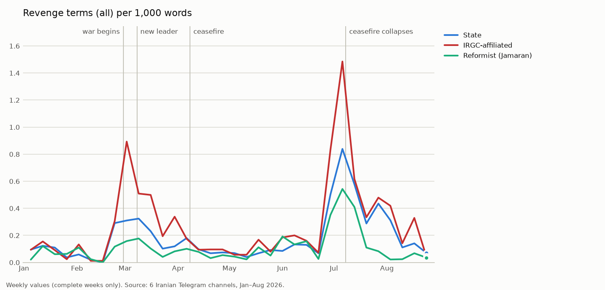

| Woche ab | Spitze | typische Begriffe dieser Woche | Ereignis |
|---|---|---|---|
| 02.03. | Rache: IRGC-nah 0,89 | `موشک‌های` (Raketen) · `خامنه‌ای` (Khamenei) · `سوگ` *sug* (Trauer) · `مجلس خبرگان` (Expertenversammlung) · `عملیات وعده صادق` („Operation Wahres Versprechen“) | Tötung Ali Khameneis (28.02.), Wahl des Nachfolgers |
| 29.06. | Märtyrer: IRGC-nah 19,1 · staatlich 14,1 · Jamaran 7,6 | `مراسم وداع` *marasem-e veda'* (Abschiedsfeier) · `مصلی تهران` *mosalla-ye Tehran* (Gebetsstätte Teheran) · `ادای احترام` (Ehrerweisung) · `بدرقه` *badragheh* (Geleit) | Trauerfeier für Ali Khamenei in Teheran |
| 06.07. | Märtyrer: IRGC-nah **21,6** · staatlich 17,5 · Rache: IRGC-nah **1,48** | `تشییع` *tashyi'* (Trauerzug) · `پیکر مطهر` (der heilige Leichnam) · `مشهد` (Maschhad) · `نجف` (Nadschaf) | Trauerzüge in Maschhad und Nadschaf |
| 13.07. | Rache: staatlich 0,58 · Jamaran 0,41 | `بندرعباس` (Bandar Abbas) · `هرمزگان` (Provinz Hormozgan) · `بوشهر` (Buschehr) · `اهواز` (Ahvaz) · `انفجار` (Explosion) · `کویت` (Kuwait) · `اردن` (Jordanien) | Angriffe nach dem Zusammenbruch der Waffenruhe (07.–08.07.) |

- Die **höchsten Werte** für „Märtyrer“ und „Rache“ im ganzen Zeitraum liegen **nicht** beim Kriegsbeginn, sondern in
  den Wochen der Trauerfeier (03.–05.07.) und der Trauerzüge (06.–09.07.) für Ali Khamenei – vier Monate nach
  seinem Tod.
- In der Woche der Trauerzüge schreiben IRGC-nahe Kanäle `خونخواهی` *khunkhahi* (Blutrache) häufiger als in der
  ersten Kriegswoche (0,58 gegenüber 0,41 pro 1.000 Wörter).
- Jamaran schreibt in dieser Woche zu 44 % „zionistisches Regime“ – der höchste Wert des Kanals im ganzen Zeitraum
  (sonst 19–39 %). Die Berichte über die Trauerfeier übernehmen die Sprache der offiziellen Erklärungen.

### Gegnerbegriffe und Internet – die Proteste im Januar

| Woche ab | Spitze | typische Begriffe dieser Woche | Ereignis |
|---|---|---|---|
| 05.01. | Gegnerbegriffe: IRGC-nah **3,34** | `اغتشاشگران` (Randalierer) · `اعتراض` (Protest) · `کالابرگ` *kalabarg* (Lebensmittelgutschein) · `ارز` *arz* (Devisen) · `روغن` (Speiseöl) · `ونزوئلا` (Venezuela) · `مادورو` (Maduro) | Proteste wegen Preisen und Rial-Verfall |
| 12.01. | Gegnerbegriffe: staatlich 2,17 · Internet: IRGC-nah 0,66 | `اغتشاشات` (Unruhen) · `تروریست‌ها` (Terroristen) · `مسلح` (bewaffnet) · `آشوبگران` (Aufrührer) · `فتنه` *fetneh* („Aufruhr“) · `پهلوی` (Pahlavi) · `موساد` (Mossad) | Internetsperre ab 08.01.; die Proteste werden als Terror und ausländisch gesteuert dargestellt |

| Woche ab | Spitze | typische Begriffe dieser Woche | Ereignis |
|---|---|---|---|
| 12.01. | alle Gruppen | Unruhen, Terroristen (siehe oben) | Internetsperre ab 08.01. |
| 11.05. | Jamaran 1,74 · staatlich 0,56 | `اینترنت پرو` („Internet Pro“) · `چین` (China) · `شی جین‌پینگ` (Xi Jinping) · `بریکس` (BRICS) · `دهلی‌نو` (Neu-Delhi) | Debatte über „Internet Pro“; Außenpolitik mit China und BRICS |
| 25.05. | Jamaran **1,76** | `اتصال` *ettesal* (Anschluss) · `بازگشایی` (Wiederöffnung) · `فضای مجازی` (Internet, wörtl. „virtueller Raum“) · `خاتمی` (Mohammad Khatami) | Debatte über die Wiederöffnung des Internets |

Jamaran ist der einzige Kanal, der das Internet über Monate zum Thema macht – von April bis Anfang Juni mehr als
fünfmal so oft wie die anderen Gruppen (1,04 gegenüber 0,17 und 0,20 pro 1.000 Wörter). Die staatlichen und IRGC-nahen
Kanäle nennen das Internet vor allem im Januar, im Zusammenhang mit den „Unruhen“.

### Verbrechen

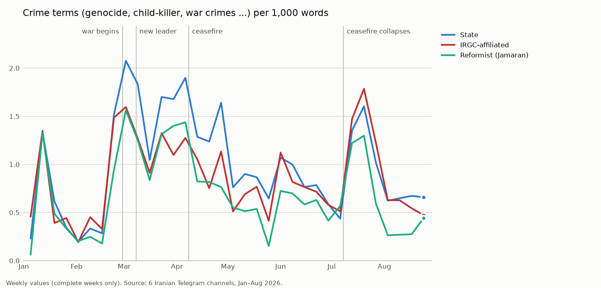

| Woche ab | Spitze | typische Begriffe dieser Woche | Ereignis |
|---|---|---|---|
| 02.03. | staatlich **2,08** · IRGC-nah 1,60 · Jamaran 1,56 | `حمله` (Angriff) · `اصابت` (Einschlag) · `تجاوز` (Aggression) · `سرزمین‌های اشغالی` („besetzte Gebiete“) · `سوگ` (Trauer) | erste Kriegswoche, Angriff auf die Schule in Minab (28.02.) |
| 06.04. | staatlich 1,90 · Jamaran 1,44 | Waffenruhe · Islamabad · 40. Tag nach dem Tod Ali Khameneis | Waffenruhe; Bilanz der ersten Kriegswochen |
| 20.07. | IRGC-nah **1,79** | `اربعین` (Arbain) · `زائران` (Pilger) · `عربستان` (Saudi-Arabien) · `یمن` (Jemen) · `کویت` (Kuwait) · `اردن` (Jordanien) | kein einzelnes Ereignis erkennbar; in dieser Woche erklärten die Huthis eine Seeblockade gegen Saudi-Arabien (20.–22.07.) |

### Bezeichnung der USA

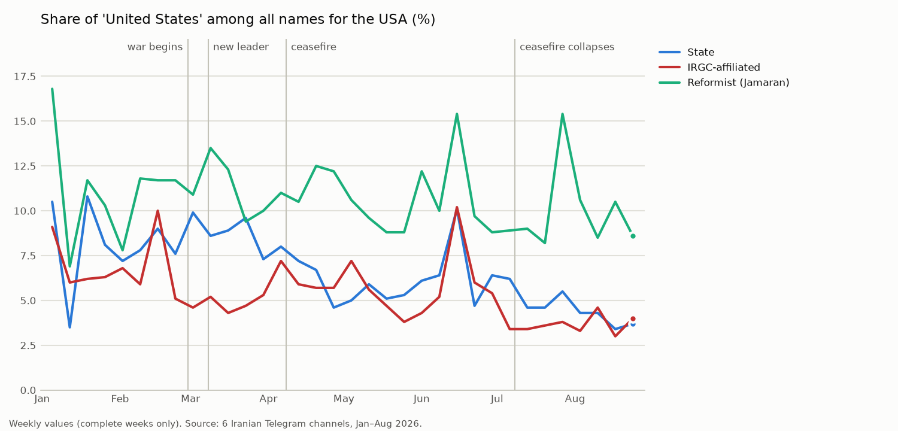

Die formale Bezeichnung `ایالات متحده` („Vereinigte Staaten“) steigt, wenn über Diplomatie oder das Ausland berichtet
wird: in der Woche ab 05.01. bei Jamaran auf 17 % (typisch: `ونزوئلا` Venezuela, `مادورو` Maduro), in der Woche ab
16.02. bei IRGC-nahen Kanälen auf 10 % (`ژنو` Genf – Atomgespräche 17.02.), in der Woche ab 15.06. bei Jamaran und
IRGC-nahen Kanälen auf 15 % bzw. 10 % (Memorandum). Bei IRGC-nahen Kanälen sinkt sie im Krieg von 8 % auf 5 %.

---

## 6. Länder und Verbündete

Welche Länder und Gruppen nennen die Kanäle – wie oft, wann und in welchem Zusammenhang? Gezählt wird mit denselben
Regeln wie in Abschnitt 3 (`12_countries.py`, Liste in `naming_terms.csv`). Rund ein Viertel aller Beiträge mit Text
(67.669) nennt mindestens ein Land oder eine Gruppe der Liste. Dieser Abschnitt zeigt 35 davon, in vier Regionen.

### Wer am häufigsten genannt wird

Pro 1.000 Wörter, ganzer Zeitraum; fett = höchster Wert. Vollständige Liste: `results/countries/countries.xlsx`.

| Land / Gruppe | staatlich | IRGC-nah | Jamaran | Nennungen gesamt |
|---|---|---|---|---|
| `لبنان` *Lobnan* – Libanon | 1,22 | **1,49** | 1,05 | 20.759 |
| `عراق` *Eraq* – Irak | 0,72 | **0,75** | 0,62 | 11.655 |
| `روسیه` *Rusiyeh* – Russland | 0,63 | 0,54 | **0,70** | 10.056 |
| `حزب‌الله` *Hezbollah* – Hisbollah | 0,45 | **0,85** | 0,44 | 9.271 |
| `پاکستان` *Pakestan* – Pakistan | 0,52 | 0,42 | **0,58** | 8.266 |
| `عربستان` *Arabestan* – Saudi-Arabien | 0,40 | **0,57** | 0,49 | 7.609 |
| `چین` *Chin* – China | 0,38 | 0,37 | **0,51** | 6.541 |
| `اتحادیه اروپا` *Ettehadiyeh-ye Orupa* – EU / Europa | **0,40** | 0,26 | 0,35 | 5.751 |
| `غزه` *Ghazzeh* – Gaza | **0,37** | 0,35 | 0,23 | 5.477 |
| `امارات` *Emarat* – VAE | 0,23 | **0,40** | 0,39 | 5.079 |
| `انگلیس` *Engelis* – Großbritannien | **0,31** | 0,26 | 0,26 | 4.741 |
| `یمن` *Yaman* – Jemen | 0,26 | **0,37** | 0,19 | 4.519 |
| `ترکیه` *Torkiyeh* – Türkei | 0,27 | 0,23 | **0,28** | 4.305 |
| `عمان` *Oman* – Oman | 0,25 | 0,24 | **0,34** | 4.302 |
| `قطر` *Qatar* – Katar | 0,23 | 0,26 | **0,30** | 4.126 |
| `کویت` *Kuweyt* – Kuwait | 0,19 | **0,31** | 0,24 | 3.858 |
| `اوکراین` *Ukrayn* – Ukraine | **0,24** | 0,22 | 0,21 | 3.704 |
| `فلسطین` *Felestin* – Palästina | **0,25** | 0,20 | 0,13 | 3.493 |
| `بحرین` *Bahreyn* – Bahrain | 0,18 | **0,28** | 0,17 | 3.392 |
| `فرانسه` *Faranseh* – Frankreich | **0,22** | 0,18 | 0,20 | 3.367 |
| `ونزوئلا` *Venezuela* – Venezuela | 0,18 | 0,15 | **0,23** | 2.986 |
| `سوریه` *Suriyeh* – Syrien | **0,18** | 0,17 | 0,16 | 2.833 |
| `هند` *Hend* – Indien | 0,16 | 0,15 | **0,17** | 2.543 |
| `اردن` *Ordon* – Jordanien | 0,13 | **0,17** | 0,13 | 2.319 |
| `آلمان` *Alman* – Deutschland | **0,15** | 0,12 | 0,13 | 2.267 |
| `اسپانیا` *Espaniya* – Spanien | **0,13** | 0,11 | 0,09 | 1.921 |
| `حماس` *Hamas* – Hamas | **0,13** | 0,07 | 0,07 | 1.648 |
| `ژاپن` *Zhapon* – Japan | **0,10** | 0,09 | 0,08 | 1.536 |
| `جمهوری آذربایجان` – Republik Aserbaidschan¹ | **0,11** | 0,08 | 0,07 | 1.520 |
| `انصارالله` *Ansarollah* / `حوثی‌ها` *Huthi-ha* – Huthis | 0,07 | **0,09** | 0,07 | 1.289 |
| `ایتالیا` *Italiya* – Italien | **0,08** | 0,06 | 0,07 | 1.152 |
| `افغانستان` *Afghanestan* – Afghanistan | 0,07 | 0,05 | **0,08** | 1.037 |
| `حشد شعبی` *Hashd-e Sha'bi* / `مقاومت عراق` – irakische Milizen | 0,04 | **0,08** | 0,03 | 799 |

¹ Zu hoch: `آذربایجان` allein meint manchmal die iranischen Provinzen (siehe [Grenzen](#9-grenzen)).

- **IRGC-nahe Kanäle** nennen die **Hisbollah fast doppelt so oft** wie die anderen. Sie nennen auch Saudi-Arabien,
  die VAE, Kuwait, Bahrain, Jordanien, Jemen und die irakischen Milizen am häufigsten – die Orte, aus denen sie über
  Angriffe berichten.
- **Jamaran** nennt am häufigsten die **Großmächte und Vermittler**: Russland, China, Pakistan, Oman, Katar. Palästina,
  Gaza und Hamas nennt Jamaran am seltensten.
- **Staatliche Kanäle** nennen am häufigsten Europa, Großbritannien, Frankreich, Deutschland, Palästina und Hamas.

### Im Krieg schrumpft die Welt

Pro 1.000 Wörter nach Phase; eine Spanne heißt: niedrigster bis höchster Wert der drei Gruppen. Alle Werte:
`countries.xlsx`, Blatt `phases`.

| | vor dem Krieg | Krieg | Waffenruhe | nach dem Zusammenbruch |
|---|---|---|---|---|
| Russland, IRGC-nah | 0,71 | **0,24** | 0,61 | 0,62 |
| China, IRGC-nah | 0,39 | **0,13** | 0,53 | 0,32 |
| EU / Europa, IRGC-nah | 0,50 | **0,18** | 0,29 | 0,16 |
| Gaza, alle Gruppen | 0,37–0,45 | **0,08–0,12** | 0,20–0,41 | 0,28–0,47 |
| Venezuela, alle Gruppen | 0,66–1,06 | **0,02–0,04** | 0,08 | 0,08–0,10 |
| Bahrain, alle Gruppen | **0,02** | 0,33–0,46 | 0,11–0,17 | 0,21–0,43 |
| Kuwait, alle Gruppen | **0,01–0,04** | 0,33–0,47 | 0,11–0,17 | 0,32–0,59 |
| VAE, IRGC-nah | 0,18 | **0,56** | 0,46 | 0,27 |
| Hisbollah, alle Gruppen | 0,14–0,18 | **0,65–1,24** | 0,59–1,20 | 0,16–0,22 |
| Libanon, alle Gruppen | 0,36–0,52 | 0,61–0,88 | **1,86–2,45** | 0,59–0,98 |
| Pakistan, alle Gruppen | 0,21–0,31 | 0,16–0,26 | **0,72–0,92** | 0,30–0,50 |
| Saudi-Arabien, IRGC-nah | 0,30 | 0,44 | 0,30 | **1,35** |
| Jemen, IRGC-nah | 0,18 | 0,21 | 0,18 | **1,00** |
| Irak, IRGC-nah | 0,44 | 0,66 | 0,53 | **1,45** |
| Jordanien, alle Gruppen | 0,07–0,09 | 0,09–0,15 | 0,03–0,06 | **0,30–0,46** |

- **Mit Kriegsbeginn verschwinden ferne Länder fast aus den Nachrichten** – am stärksten in den IRGC-nahen Kanälen:
  Russland und China werden dort nur noch ein Drittel so oft genannt wie vor dem Krieg. Bei Jamaran sinkt Russland
  nur um ein Viertel (0,98 → 0,72) und ist im Krieg dreimal so häufig wie in den IRGC-nahen Kanälen.
- **Bahrain und Kuwait** kommen vor dem Krieg praktisch nicht vor. Mit Kriegsbeginn werden sie zu Schauplätzen: Iran
  greift US-Stützpunkte in den Golfstaaten an.
- **Die Hisbollah** tritt am 02.03. in den Krieg ein und wird in Krieg und Waffenruhe drei- bis siebenmal so oft
  genannt wie vorher. Nach dem Zusammenbruch der Waffenruhe fällt sie fast auf den Vorkriegswert zurück.
- **Jede Phase hat ihr Land:** der **Libanon** in der Waffenruhe, **Pakistan** als Vermittler der Waffenruhe,
  **Saudi-Arabien, Jemen, Irak und Jordanien** nach dem Zusammenbruch.

### Welcher Golfstaat wann im Fokus war

| Phase | am häufigsten genannt (Spanne der drei Gruppen) | Zusammenhang |
|---|---|---|
| vor dem Krieg | Oman 0,28–0,46 · Saudi-Arabien 0,30–0,32 | Oman vermittelt die Atomgespräche in Maskat |
| Krieg | VAE 0,36–0,56 · Kuwait 0,33–0,47 · Bahrain 0,33–0,46 | Iran greift US-Stützpunkte am Golf an |
| Waffenruhe | VAE 0,26–0,49 · Saudi-Arabien 0,23–0,37 | Angriff auf den Hafen Fudschaira (VAE, Woche ab 04.05.) |
| nach dem Zusammenbruch | Saudi-Arabien 0,82–1,35 · Kuwait 0,32–0,59 · Oman 0,33–0,51 · Jordanien 0,30–0,46 | Jemen und Irak; Angriffe auf US-Stützpunkte; Durchfahrt durch Hormus |

### Wann: die Spitzen und was dahinter steckt

`12_countries.py` sucht für jedes Land die zwei Wochen mit dem höchsten Wert (Nennungen pro 1.000 Wörter, alle Gruppen
zusammen) und vergleicht die Beiträge über das Land **in dieser Woche** mit den Beiträgen über das Land in allen
anderen Wochen. Die Tabellen zeigen die typischsten Begriffe. Alle Werte: `results/countries/peak_weeks.csv`.

#### Golfstaaten und Jordanien

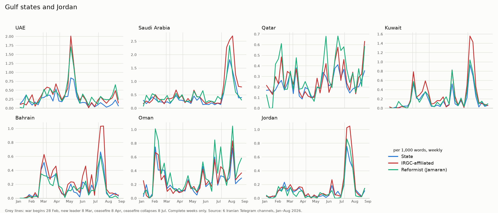

| Land | Woche ab (Wert) | typische Begriffe der Beiträge über das Land in dieser Woche | Ereignis |
|---|---|---|---|
| VAE | 04.05. (1,36) | `بندر فجیره` *bandar-e Fujeyreh* (Hafen Fudschaira) · `تنگه هرمز` (Straße von Hormus) · `کوبنده` *kubandeh* („vernichtend“) · `نیروهای مسلح جمهوری اسلامی ایران` (Streitkräfte Irans) | Angriff auf den Hafen Fudschaira |
| VAE | 11.05. (0,99) | `نتانیاهو` (Netanjahu) · `سفر` (Reise) · `مخفیانه` *makhfiyaneh* (geheim) · `تکذیب` *takzib* (Dementi) · `براکه` (Atomkraftwerk Barakah) | Berichte über einen geheimen Besuch Netanjahus in den VAE, mit Dementi |
| Saudi-Arabien | 27.07. (2,10) | `عراق` (Irak) · `حملات` (Angriffe) · `الحشد الشعبی` (Haschd-Milizen) · `تجاوز` (Aggression) · `محکوم` (verurteilt) · `اربعین` (Arbain) · `کربلا` (Kerbela) | Angriffe auf Stellungen der irakischen Milizen, die in diesen Beiträgen Saudi-Arabien zugeschrieben werden |
| Saudi-Arabien | 03.08. (1,71) | `مزدوران` *mozduran* („Söldner“) · `یمن` (Jemen) · `مارب` (Marib) · `المخا` (Mokka) · `توافقنامه دفاعی` (Verteidigungsabkommen) · `ترکیه` (Türkei) | Kämpfe im Jemen; Verteidigungsabkommen mit der Türkei |
| Kuwait | 13.07. (1,14), 20.07. (0,90) | `عملیات صاعقه` *amaliyat-e sa'eqeh* („Operation Blitz“) · `عریفجان` (US-Stützpunkt Camp Arifjan) · `آشیانه` (Hangar) · `پاتریوت` (Patriot-Abwehr) · `ارتش تروریستی آمریکا` („terroristische Armee Amerikas“) | iranische Angriffe auf US-Stützpunkte nach dem Zusammenbruch der Waffenruhe |
| Bahrain | 13.07. (0,76), 20.07. (0,60) | `مخازن سوخت` (Treibstofftanks) · `شیخ عیسی` (Luftwaffenstützpunkt Scheich Isa) · `عملیات صاعقه` („Operation Blitz“) · `آمازون` (Amazon) | dieselbe Angriffswelle |
| Jordanien | 13.07. (0,86), 20.07. (0,71) | `مخازن سوخت` (Treibstofftanks) · `عملیات صاعقه` · `جنگنده‌ها` (Kampfflugzeuge) | dieselbe Angriffswelle |
| Oman | 02.02. (0,78) | `مسقط` *Masqat* (Maskat) · `استیو ویتکاف` (Steve Witkoff, US-Sondergesandter) · `هسته‌ای` (nuklear) | Atomgespräche in Maskat (06.02.) |
| Oman | 03.08. (0,83) | `تنگه هرمز` · `ترتیبات موقت` (vorläufige Regelungen) · `کریدور` (Korridor) · `بازگشایی` (Wiederöffnung) | Regelungen für die Durchfahrt durch Hormus |
| Katar | 22.06. (0,50) | `کمیته فنی` (technischer Ausschuss) · `نظارت` (Überwachung) · `سوئیس` (Schweiz) · `چهارجانبه` (Vierer-) | Umsetzung des Islamabad-Memorandums |

#### Libanon, Palästina, Irak, Jemen, Syrien

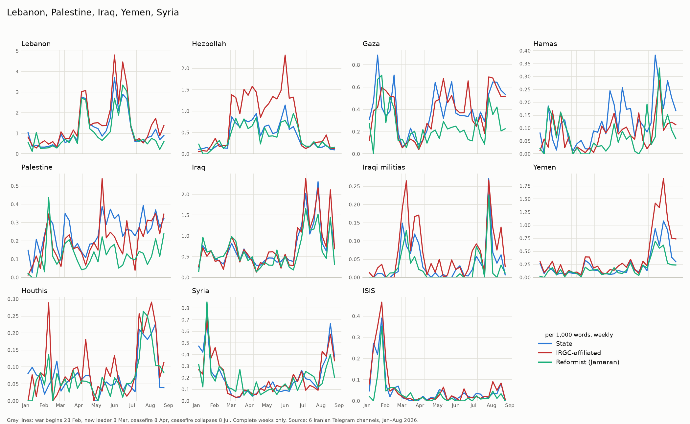

| Land / Gruppe | Woche ab (Wert) | typische Begriffe der Beiträge in dieser Woche | Ereignis |
|---|---|---|---|
| Libanon | 01.06. (**3,82**) | `ضاحیه` *Zahiyeh* (Dahiyeh, Süd-Beirut) · `قلعه` (Burg – Beaufort) · `متوقف` (gestoppt) · `تماس‌های تلفنی` (Telefonate) · `عراقچی` (Araghchi) · `تشدید` (Eskalation) | Eskalation im Libanon; Telefonate des Außenministers – höchster Wochenwert aller Länder |
| Hisbollah | 01.06. (1,39) | `قلعه` / `الشقیف` (Beaufort-Burg, *Qal'at al-Shaqif*) · `بیروت` (Beirut) · `نبیه بری` (Nabih Berri, Parlamentspräsident des Libanon) · `ضاحیه` | dieselbe Woche |
| Libanon | 15.06. (3,40) | `تفاهم‌نامه` (Memorandum) · `خاتمه جنگ` (Kriegsende) · `بندهای` (Klauseln) · `ونس` (JD Vance, US-Vizepräsident) | Libanon als Teil des Islamabad-Memorandums |
| Hisbollah | 13.04. (1,08) | `آتش‌بس` (Waffenruhe) · `پذیرش مشروط` (bedingte Annahme) · `بنت‌جبیل` (Bint Dschbeil) | Waffenruhe; Kämpfe um Bint Dschbeil |
| Irak | 06.07. (2,07) | `نجف` (Nadschaf) · `تشییع` (Trauerzug) · `رهبر شهید` (der Märtyrer-Führer) | Trauerzug für Ali Khamenei in Nadschaf |
| Irak | 27.07. (2,11) | `عربستان` (Saudi-Arabien) · `زائران` (Pilger) · `اربعین` · `حملات` (Angriffe) · `محکوم` (verurteilt) | Angriffe auf die Haschd-Milizen; Arbain-Pilgerfahrt |
| Jemen | 20.07. (1,02) | `محاصره دریایی` (Seeblockade) · `الحدیده` (Hodeida) · `جیزان` (Dschasan) · `نفتکش` (Tanker) | Seeblockade der Huthis gegen Saudi-Arabien (20.–22.07.) |
| Jemen | 03.08. (1,20) | `مارب` (Marib) · `المخا` (Mokka) · `مزدوران` („Söldner“) | Kämpfe im Jemen |
| Gaza | 19.01. (0,67), 16.02. (0,60) | `شورای صلح` *shura-ye solh* („Friedensrat“) · `ترامپ` · `منشور` (Charta) · `دعوت` (Einladung) | Trumps „Friedensrat“ für Gaza |
| Palästina | 09.02. (0,36) | `کرانه باختری` (Westjordanland) · `الحاق` *elhaq* (Annexion) · `آلبانیز` (Francesca Albanese, UN-Sonderberichterstatterin) · `غیرقانونی` (illegal) | Annexionspläne im Westjordanland |
| Palästina | 11.05. (0,40) | `یامال` (Lamine Yamal) · `بارسلونا` (FC Barcelona) · `پرچم` (Flagge) · `نکبت` *Nakbat* (Nakba-Tag, 15.05.) · `عزالدین الحداد` (Izz ad-Din al-Haddad, Kommandeur der Qassam-Brigaden der Hamas) | Fußball und Nakba-Tag |
| Hamas | 20.07. (0,27) | `خلیل الحیه` (Khalil al-Hayya) · `انتخاب` (Wahl) · `تبریک` (Glückwunsch) | al-Hayya neuer Hamas-Chef |
| Hamas | 27.07. (0,28) | `خلع سلاح` *khal'-e selah* (Entwaffnung) · `پیش‌نویس` (Entwurf) | Entwurf zur Entwaffnung der Hamas |
| Syrien | 19.01. (0,72) | `قسد` (SDF, kurdisch geführte Kräfte) · `کردها` (Kurden) · `فرار` (Flucht) · `داعش` (IS) | Kämpfe im Nordosten Syriens, IS-Gefangene |
| Syrien | 17.08. (0,59) | `ترکیه` (Türkei) · `ابوالظهور` (Flugplatz Abu al-Duhur) · `ادلب` (Idlib) · `الشیبانی` (Asaad al-Shaibani, Außenminister Syriens) · `اسرائیل` | Türkei und Israel in Syrien |

#### Großmächte und Nachbarn

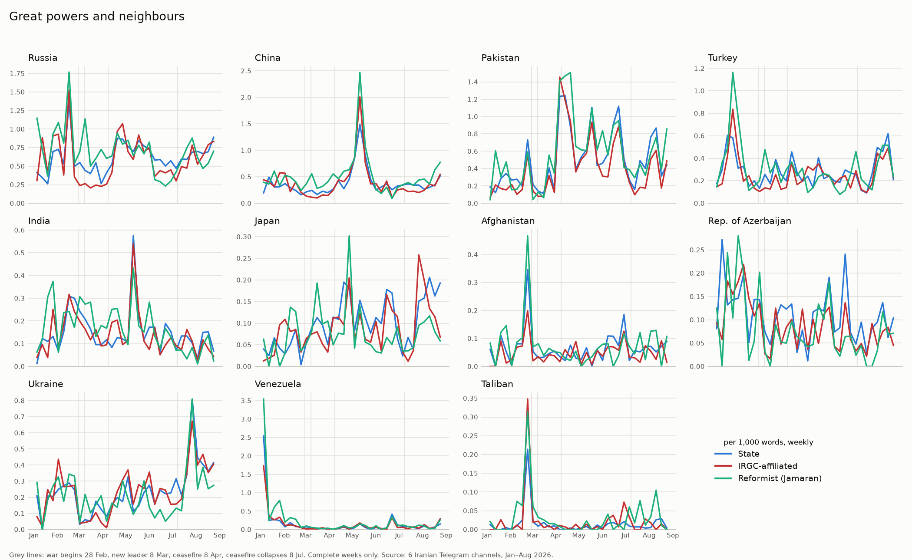

| Land | Woche ab (Wert) | typische Begriffe der Beiträge in dieser Woche | Ereignis |
|---|---|---|---|
| Venezuela | 05.01. (2,50) | `ربوده` *robudeh* („entführt“) · `همسر` (Ehefrau) · `دادگاه` (Gericht) · `حقوق بین‌الملل` (Völkerrecht) · `نقض` (Verletzung) | Gefangennahme Nicolás Maduros und seiner Frau durch die USA – in iranischen Kanälen „Entführung“ und Völkerrechtsbruch |
| Türkei | 26.01. (0,73) | `عراقچی` · `مشورت‌ها` (Beratungen) · `کاهش تنش‌ها` (Deeskalation) | Beratungen des Außenministers mit der Türkei |
| Russland | 16.02. (1,48) | `رزمایش` (Manöver) · `نیروی دریایی` (Marine) · `اقیانوس هند` (Indischer Ozean) · `مشترک` (gemeinsam) | gemeinsames Marinemanöver |
| Indien | 16.02. (0,30) | `رزمایش` (Manöver) · `میلان` (MILAN) · `دریادار` (Admiral) | Marinemanöver MILAN |
| Afghanistan | 23.02. (0,34) | `پاکستان` · `طالبان` (Taliban) · `درگیری` (Gefechte) · `مرزی` (Grenz-) | Gefechte zwischen Pakistan und den Taliban |
| Pakistan | 06.04. (1,33), 13.04. (1,27) | `مذاکرات` (Verhandlungen) · `هیئت` (Delegation) · `خبرنگار اعزامی` (entsandter Reporter) · `ونس` (JD Vance) · `فرمانده ارتش پاکستان` (Armeechef Pakistans, Asim Munir) · `اسلام آباد` | Vermittlung der Waffenruhe, Gespräche in Islamabad |
| China | 11.05. (1,81) | `ترامپ` · `سفر` (Reise) · `شی جین‌پینگ` (Xi Jinping) · `تایوان` (Taiwan) · `پکن` (Peking) | Trumps Reise nach Peking |
| China | 18.05. (0,90) | `پوتین` (Putin) · `سفر` (Reise) | Putins Reise nach China |
| Indien | 11.05. (0,54) | `بریکس` (BRICS) · `دهلی نو` (Neu-Delhi) · `عراقچی` · `وزرای خارجه` (Außenminister) | BRICS-Außenministertreffen in Neu-Delhi |
| Rep. Aserbaidschan | 22.06. (0,18) | `قالیباف` (Ghalibaf) · `باکو` (Baku) · `اجلاس` (Konferenz) · `مجالس` (Parlamente) | Ghalibaf auf einer Parlamentskonferenz in Baku |
| Ukraine | 27.07. (0,78) | `دریای خزر` (Kaspisches Meer) · `کشتی` (Schiff) · `سیبیها` (Andrij Sybiha, Außenminister der Ukraine) · `عراقچی` | Streit um ein Schiff im Kaspischen Meer |
| Japan | 10.08. (0,17) | `کوریل` (Kurilen) · `پوتین` (Putin) · `جزایر` (Inseln) | Streit um die Kurilen |
| Türkei | 17.08. (0,57) | `سوریه` (Syrien) · `پایگاه` (Stützpunkt) · `نتانیاهو` · `فرودگاه` (Flugplatz) | Türkei und Israel in Syrien (wie Syrien in derselben Woche) |

#### Europa

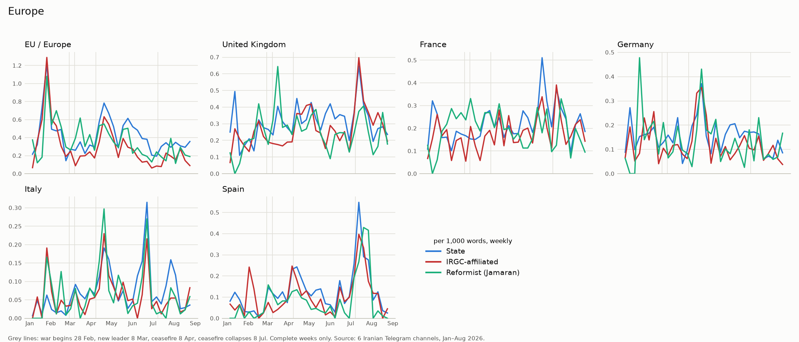

| Land | Woche ab (Wert) | typische Begriffe der Beiträge in dieser Woche | Ereignis |
|---|---|---|---|
| EU / Europa | 26.01. (1,22) | `سپاه پاسداران` (Revolutionsgarde) · `تروریستی` (terroristisch) · `خصمانه` (feindselig) · `غیرمسئولانه` (unverantwortlich) | politische Einigung der EU (29.01.), die Revolutionsgarde als Terrororganisation einzustufen – und Irans Reaktion |
| EU / Europa, Deutschland | 20.04. (0,69 / 0,26) | `رضا پهلوی` (Reza Pahlavi) · `انرژی` (Energie) · `قیمت بنزین` (Benzinpreis) | Reza Pahlavi in Europa; Energiepreise |
| Deutschland | 27.04. (0,38) | `صدراعظم آلمان` (Bundeskanzler) · `تحقیر` (Demütigung) · `پنتاگون` (Pentagon) · `خروج` (Abzug) · `ترامپ` | Äußerung des Bundeskanzlers („Demütigung“) und Reaktion aus Washington |
| Italien | 22.06. (0,28) | `ناتو` (NATO) · `پایگاه‌های` (Stützpunkte) · `رومانی` (Rumänien) | NATO-Stützpunkte in Europa |
| Großbritannien, Frankreich, Spanien | 13.07. (0,61 / 0,33 / 0,45) | `جام جهانی` (Weltmeisterschaft) · `فینال` (Finale) · `آرژانتین` (Argentinien) · `مسی` (Messi) | Fußball-WM |

In der Woche des WM-Finales wird Spanien öfter genannt als in jeder anderen Woche, Frankreich auch schon in der
Gruppenphase (22.06.): Ein Teil der Europa-Nennungen ist Sport.

### Wie jede Gruppe ein Land darstellt

Welche Begriffe verwendet eine Gruppe **in den Beiträgen über ein Land** deutlich häufiger als die anderen Gruppen in
ihren Beiträgen über dasselbe Land? Auswahl der typischsten Begriffe; alle Listen: `results/countries/framing.csv`.

| Land | staatlich | IRGC-nah | Jamaran |
|---|---|---|---|
| VAE | `تومان` (Toman) · `سکه` (Goldmünze) · `حواله` (Überweisung) – **Dubai als Devisenplatz** | `بندر فجیره` (Hafen Fudschaira) · `زیرساخت‌ها` (Infrastruktur) · `پدافندی` (Luftabwehr) – **Angriffsziel** | `ترامپ` · `توافق` (Abkommen) · `اندیشکده` (Thinktank) – **Geopolitik** |
| Saudi-Arabien | `رایزنی` (Beratung) · `وزیر` (Minister) · `محکوم` (verurteilt) – **diplomatischer Partner** | `یمن` · `مزدوران` („Söldner“) · `صنعا` (Sanaa) · `محاصره` (Blockade) – **Gegner im Jemen** | `اسرائیل` · `حوثی‌ها` (Huthis) · `ابوظبی` (Abu Dhabi) · `وابستگی` (Abhängigkeit) – **Rivale in der Region** |
| Katar | `رایزنی` (Beratung) · `آل ثانی` (Al Thani) · `کاهش تنش‌ها` (Deeskalation) – **Vermittler** | `هلیوم` (Helium) · `نیروگاه` (Kraftwerk) · `راس‌لفان` (Ras Laffan, Gasanlagen) – **Energie-Infrastruktur** | `ترامپ` · `نیویورک‌تایمز` · `مذاکرات` – **Verhandlungen** |
| Oman | `رایزنی` (Beratung) · `وزیر امور خارجه` – **Vermittler** | `تنگه هرمز` · `کشتی` (Schiff) · `مسندم` (Musandam) – **Seeweg** | `پیشنهاد` (Vorschlag) · `مدعی` („behauptet“) · `لاریجانی` (Ali Larijani) – **Verhandlungen** |
| Kuwait | `بسم الله قاصم الجبارین` (Überschrift militärischer Erklärungen) · `روابط عمومی سپاه پاسداران` (Pressestelle der Revolutionsgarde) · `اطلاعیه` (Bekanntmachung) – **offizielle Erklärungen** | `منابع` (Quellen) · `تصاویر` (Bilder) · `شنیده‌شدن` (zu hören sein) · `انفجارها` (Explosionen) – **Augenzeugen und Bilder** | `کشورهای عربی` (arabische Staaten) · `امنیت` (Sicherheit) · `اقتصادی` (wirtschaftlich) – **Region** |
| Bahrain | `سخنگوی وزارت امور خارجه` (Außenamtssprecher) · `بسم الله قاصم الجبارین` · `روابط عمومی سپاه` – **Erklärungen** | `شنیده‌شدن` (zu hören sein) · `آمازون` (Amazon) · `ابری` (Cloud) · `فرمول` (Formel 1) | `امارات متحده عربی` · `قطر` · `انرژی` (Energie) · `نفت` (Öl) – **Golf und Energie** |
| Jordanien | `کرانه باختری` (Westjordanland) · `ثبات` (Stabilität) · `دیپلماسی` | `پایگاه` (Stützpunkt) · `موشک‌های` (Raketen) · `گاز` · `برق` (Strom) | `اطلاعاتی` (Geheimdienst-) · `سرباز` (Soldat) · `پایگاه‌ها` (Stützpunkte) · `آمریکایی` – **US-Militär** |
| Pakistan | `تجارت` (Handel) · `سازمان ملل` (UN) · `بقائی` (Baghaei) – **Diplomatie** | `خبرنگار اعزامی` (entsandter Reporter) · `تیم مذاکره‌کننده` (Verhandlungsteam) · `قالیباف` · `ونس` – **Islamabad aus der Nähe** | `ابوظبی` (Abu Dhabi) · `پیشنهاد` (Vorschlag) · `واشنگتن` – **Vermittlung** |
| China | `پکن` (Peking) · `آسیا` · `رسانه‌های` (Medien) | `نفتکش` (Tanker) · `عبور` (Durchfahrt) · `تایوان` – **Öl und Hormus** | `ایالات متحده` · `نفت` (Öl) · `احتمالا` (wahrscheinlich) – **Rivalität mit den USA** |
| Russland | `تاس` (TASS) · `سفیر` (Botschafter) · `مسکو` · `بریکس` – **offizieller Partner** | `اوکراینی` (ukrainisch) · `پالایشگاه` (Raffinerie) · `حمله پهپادی` (Drohnenangriff) – **Krieg in der Ukraine** | `ترامپ` · `بازارهای` (Märkte) · `ریانووستی` (RIA Nowosti) · `صادرات` (Export) – **Öl und Politik** |
| Türkei | `جنگ رمضان` („Ramadan-Krieg“) · `بقائی` – **Diplomatie** | `فوتبال` · `هتل` · `یورو` – **Sport und Reisen** | `ائتلاف` (Bündnis) · `غنی‌سازی` (Anreicherung) · `تجزیه` (Spaltung) – **Sicherheitspolitik** |
| Libanon | `تداوم نقض آتش بس` (anhaltende Verletzung der Waffenruhe) · `سازمان ملل` · `وزارت بهداشت` (Gesundheitsministerium) – **Recht und Opfer** | `شهرک` (Siedlung) · `حزب‌الله` · `نظامیان` (Soldaten) · `حمله موشکی` (Raketenangriff) – **Front** | `مذاکرات` · `مدعی` („behauptet“) · `نتانیاهو` – **Verhandlungen** |
| Irak | `اربعین` · `ثبات` (Stabilität) · `هماهنگی` (Abstimmung) – **Nachbar und Pilgerland** | `حشد شعبی` (Haschd-Milizen) · `تجزیه‌طلب` (Separatisten) · `اربیل` (Erbil) – **Sicherheit, kurdische Gruppen** | `ترامپ` · `میلیارد دلار` · `لاریجانی` – **Geopolitik** |
| Jemen | `انصارالله یمن` (Ansarallah) · `دفتر سیاسی جنبش` (Politbüro der Bewegung) | `سعودی` (saudisch) · `مزدوران` („Söldner“) · `باب‌المندب` (Bab al-Mandab) | `حوثی‌ها` (Huthis) · `امارات` · `ابوظبی` |
| Gaza | `مجروحان` (Verletzte) · `شهدای` (Märtyrer) · `وزارت بهداشت` (Gesundheitsministerium) – **Opfer** | `خان‌یونس` (Chan Yunis) · `منابع محلی` (lokale Quellen) · `النصیرات` (Nuseirat) – **Front** | `نتانیاهو` · `ترامپ` – **Politik** |
| Syrien | `نقض` (Verletzung) · `حاکمیت` (Souveränität) · `سازمان ملل` – **Völkerrecht** | `جولانی` / `الجولانی` (Jolani – früherer Kampfname des Präsidenten Ahmed al-Scharaa) · `شورشیان` (Rebellen) | `اسد` (Assad) · `ترامپ` – **Politik** |
| EU / Europa | `بروکسل` (Brüssel) · `دیپلماسی` · `حقوق بین‌الملل` (Völkerrecht) | `رضا پهلوی` (Reza Pahlavi) · `تجمع` (Kundgebung) – **Ort der Opposition** | `تضمین` (Garantie) · `آینده` (Zukunft) |
| Großbritannien | `لندن` · `داونینگ‌استریت` (Downing Street) | `کشتی` (Schiff) · `حادثه` (Vorfall) · `نفتکش` (Tanker) – **Schiffsvorfälle** | `مصدق` (Mohammad Mossadegh, Putsch 1953) · `نفت` (Öl) – **Geschichte** |

**Unterschiede zwischen den Kanälen** (pro 1.000 Wörter, `countries.xlsx` bzw. `countries.csv`, Ebene `channel`):
IRNA nennt Russland im Krieg fast so oft wie vorher (0,66 → 0,63), Fars, Tasnim und Mehr nur noch zu einem Drittel
(0,21–0,27). IRNA nennt die Hisbollah am seltensten (0,28, Tasnim 0,88) und die VAE am seltensten (0,19, Fars 0,48).
Pakistan erreicht in allen sechs Kanälen seinen höchsten Wert in der Waffenruhe (0,63–0,92).

### Was auffällt

- **Drei Arten, dieselbe Welt zu zeigen.** Staatliche Kanäle berichten über Länder in der Sprache der Diplomatie und des
  Völkerrechts (Beratung, Verurteilung, UN). IRGC-nahe Kanäle zeigen Länder als **Schauplatz**: Häfen, Stützpunkte,
  Raffinerien, Fronten. Jamaran sieht fast jedes Land durch die **Brille der USA** – mit Trump, „Abkommen“ und
  „behauptet“.
- **Die VAE** sind zweierlei: für die Staatsmedien ein Devisenplatz (Toman, Goldmünzen, Überweisungen), für die
  IRGC-nahen Kanäle ein Angriffsziel (Hafen Fudschaira, Woche ab 04.05.). In der Woche danach sind die typischen
  Begriffe Netanjahu, geheim, Dementi – die Nähe der VAE zu Israel wird Thema. Bei Jamaran steht `ابوظبی` (Abu Dhabi)
  auch in den Beiträgen über Pakistan, Saudi-Arabien, Jemen und Indien: die VAE als Akteur im Hintergrund.
- **Saudi-Arabien** ist für die Staatsmedien ein Gesprächspartner, für die IRGC-nahen Kanäle der Gegner im Jemen
  („Söldner“). Nach dem Zusammenbruch der Waffenruhe wird es dort viereinhalbmal so oft genannt wie vorher.
- **Kuwait und Bahrain:** Die staatlichen Kanäle berichten über die Angriffe dort mit den Erklärungen der
  Revolutionsgarde, die IRGC-nahen Kanäle mit „Quellen“, Bildern und Explosionen, die „zu hören“ waren.
- **Pakistan** wird überall als Vermittler wahrgenommen, aber verschieden: bei den Staatsmedien mit Handel und UN, bei
  den IRGC-nahen Kanälen mit eigenen Reportern in Islamabad, neben `قالیباف` (Ghalibaf) und `تیم مذاکره‌کننده`
  (Verhandlungsteam), bei Jamaran mit Vorschlägen, Washington und Abu Dhabi.
- **China** erreicht seine Spitze nicht mit einem Ereignis zwischen Iran und China, sondern mit Trumps Reise nach Peking.
- **Russland** tritt im Krieg in den Hintergrund – in den IRGC-nahen Kanälen auf ein Drittel. In ihren Beiträgen über
  Russland geht es vor allem um den Krieg in der Ukraine. Staatliche Kanäle zitieren über Russland und die Ukraine
  russische Quellen (`تاس` TASS, `سخنگوی کرملین` Kremlsprecher, `زاخارووا` Maria Sacharowa, Sprecherin des russischen
  Außenministeriums).
- **Syriens Präsident** heißt in den IRGC-nahen Kanälen `جولانی` (Jolani) – sein früherer Kampfname als Dschihadist.
- **Jemens Huthis** heißen bei Jamaran `حوثی‌ها` (Huthis), bei den Staatsmedien `انصارالله` (Ansarallah) – der Name,
  den die Bewegung selbst verwendet.
- **Gaza** verschwindet im Krieg fast aus den Nachrichten (von 0,37–0,45 auf 0,08–0,12) und kommt erst mit der
  Waffenruhe zurück.

---

## 7. Themen laut KI

Grundlage ist die KI-Einordnung von 10.750 Beiträgen (Gemma 4 31B, Codebuch v8), gewichtet auf alle 231.406 Beiträge
mit mehr als 80 Zeichen ([03](03_ki_einordnung.md), `03e_topics.py`). Angegeben ist der Anteil der Beiträge in Prozent.
In der Endvalidierung an 200 neuen Beiträgen stimmte das Thema in **72,5 %** der Fälle (95-%-Intervall 65,9–78,2 %).
Der **Ton** wird nicht ausgewertet: Die KI übersieht nicht-neutrale Töne, und zwar je Gruppe verschieden stark
([03, Abschnitt 8](03_ki_einordnung.md#8-endvalidierung-phase-c--ergebnis)).

| Thema | staatlich | IRGC-nah | Jamaran |
|---|---|---|---|
| `military` – Militär | 16,6 | **22,5** | 22,2 |
| `diplomacy` – Diplomatie | 12,9 | 12,0 | **20,0** |
| `domestic_politics` – Innenpolitik | **14,8** | 13,6 | 14,5 |
| `other` – Sonstiges (Service, Wetter, Sport, Kultur) | **16,2** | 9,8 | 6,3 |
| `economy` – Wirtschaft | 8,0 | 8,1 | **9,7** |
| `foreign_affairs` – Ausland ohne Iran | 8,5 | 7,9 | **10,4** |
| `mourning_commemoration` – Trauer und Gedenken | **9,7** | 9,4 | 6,8 |
| `resistance_axis` – Achse des Widerstands | 6,5 | **9,1** | 5,8 |
| `ideology_propaganda` – Ideologie | 6,9 | **7,6** | 4,3 |

Anteile in %, ganzer Zeitraum. Pro Kanal: `results/ai/topics/topic_shares.xlsx`.

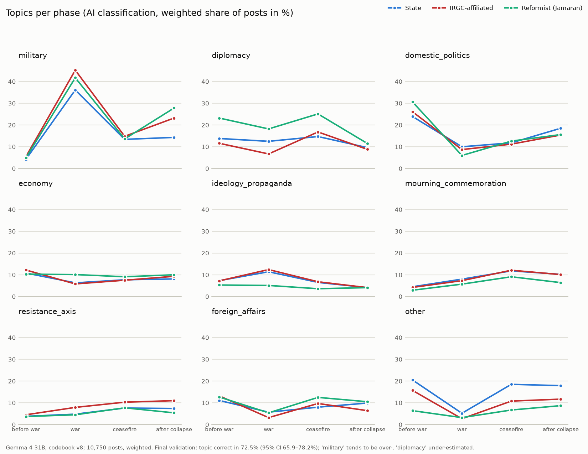

| | vor dem Krieg | Krieg | Waffenruhe | nach dem Zusammenbruch |
|---|---|---|---|---|
| Militär, alle Gruppen | 4–5 | **36–45** | 13–15 | 14–28 |
| Innenpolitik, alle Gruppen | **24–31** | 6–10 | 11–13 | 15–19 |
| Diplomatie, Jamaran | 23,2 | 18,2 | **25,1** | 11,5 |
| Diplomatie, IRGC-nah | 11,6 | **6,7** | 16,8 | 8,8 |
| Trauer und Gedenken, alle Gruppen | 3–5 | 6–8 | **9–12** | 6–10 |
| Achse des Widerstands, IRGC-nah | 4,5 | 7,9 | 10,3 | **11,0** |
| Ideologie, staatlich / IRGC-nah | 7,3 / 7,2 | **11,4 / 12,4** | 6,5 / 6,8 | 4,1 / 4,1 |
| Sonstiges, staatlich | 20,5 | **5,2** | 18,5 | 17,9 |

Anteile in %; eine Spanne heißt: niedrigster bis höchster Wert der drei Gruppen.

- **Der Krieg verdrängt alles:** In der Kriegsphase sind 36–45 % der Beiträge militärisch, vorher 4–5 %. Innenpolitik
  fällt von 24–31 % auf 6–10 %, Service, Sport und Kultur verschwinden fast.
- **Jamaran ist der Kanal der Diplomatie** – in jeder Phase mit dem höchsten Anteil, in der Waffenruhe ein Viertel aller
  Beiträge. Das passt zur Wortanalyse (Verhandlungen, Trump, Atomfrage, Abschnitt 1). Nach dem Zusammenbruch der
  Waffenruhe fällt Diplomatie in allen Gruppen auf 9–12 %.
- **IRGC-nahe Kanäle** berichten im Krieg am wenigsten über Diplomatie (6,7 %) und am meisten über die Achse des
  Widerstands, deren Anteil bis August stetig steigt.
- **Ideologie** ist bei staatlichen und IRGC-nahen Kanälen im Krieg am höchsten (11–12 %), bei Jamaran in allen Phasen
  niedrig (4–5 %).
- **Trauer und Gedenken** steigen nach dem Krieg auf 9–12 % – die Zeit der Gedenkfeiern und der Trauerfeier für
  Ali Khamenei (03.–10.07.).
- **Staatliche Kanäle** veröffentlichen außerhalb des Krieges viele Service-Meldungen (Sonstiges 18–21 %) und berichten
  nach dem Zusammenbruch der Waffenruhe weniger über Militär (14 %) als IRGC-nahe Kanäle (23 %) und Jamaran (28 %).

**Vorsicht beim Lesen:** In der Endvalidierung vergab die KI *military* zu oft und *diplomacy* zu selten – vor allem
bei Analysen des Krieges. Militär ist deshalb eher überschätzt, Diplomatie eher unterschätzt; das betrifft alle
Phasen ähnlich, Veränderungen über die Zeit sind verlässlicher als die Höhe. Bei Jamaran war die Themenzuordnung am
unsichersten (55,9 % richtig, nur 34 Beiträge geprüft); der hohe Militäranteil nach dem Zusammenbruch kann teilweise
aus Analysen des Krieges stammen.

---

## 8. Aktivität und Reichweite

| | staatlich | IRGC-nah | Jamaran |
|---|---|---|---|
| Beiträge pro Tag und Kanal | 237 | 222 | 195 |
| Aufrufe pro Beitrag (Median) | 1.259 | **11.858** | 1.593 |
| Weiterleitungen pro Beitrag (Median) | 5 | **18** | 5 |
| Weiterleitungen pro 1.000 Aufrufe | **5,1** | 2,1 | 4,2 |

- **Aktivität:** Vor dem Krieg veröffentlicht ein Kanal im Schnitt 120–135 Beiträge am Tag. In der ersten Kriegswoche
  (ab 02.03.) sind es 320–420 – bei Mehr News sogar 505. Die zweite Spitze liegt in der Woche der Trauerfeier und des
  Zusammenbruchs der Waffenruhe (ab 29.06./06.07.).
- **Januar:** In der Woche ab 12.01. postet Jamaran nur 20 Beiträge am Tag, IRNA in dieser Woche gar nichts –
  die Zeit der Internetsperre.
- **Reichweite:** Tasnim und Fars erreichen rund zehnmal so viele Aufrufe pro Beitrag. Das hängt vor allem an der Zahl
  der Abonnenten, die nicht erhoben wurde – es beschreibt Reichweite, nicht Qualität.
- **Weniger Aufrufe im Krieg:** Mit Kriegsbeginn sinken die Aufrufe pro Beitrag in allen Gruppen, bei Jamaran von
  3.329 auf 969 (Median), obwohl mehr gepostet wird. Mögliche Gründe – mehr Beiträge für dieselben Leser,
  eingeschränkter Internetzugang – lassen sich mit diesen Daten nicht trennen.
- **Weiterleitungen:** Beiträge staatlicher Kanäle und Jamarans werden pro Aufruf etwa doppelt so oft weitergeleitet
  wie die der IRGC-nahen Kanäle.

Weitere Diagramme: [Aufrufe](../../results/activity/charts/views_median.png) ·
[Weiterleitungen pro 1.000 Aufrufe](../../results/activity/charts/forwards_per_1000_views.png)

---

## 9. Grenzen

- **Zählen ist nicht Verstehen.** Die Zählung erkennt keinen Zusammenhang: Verneinung, Zitat oder Ironie zählen gleich.
  Ob ein Begriff zustimmend oder distanziert verwendet wird, zeigt erst die KI-Einordnung oder das Lesen.
- **Spitzenwochen:** Die typischen Begriffe einer Woche zeigen, was die Woche prägte – nicht, dass jeder Beitrag mit dem
  gezählten Wort davon handelt. Die Zuordnung zu Ereignissen ist eine Deutung auf Grundlage von Daten und Zeitleiste.
- **Setzungen des Autors:** Korrekturliste, Benennungsliste, Phasen- und Ereignisdaten. Sie sind offen dokumentiert;
  andere Setzungen ergäben leicht andere Zahlen.
- **Regeln mit Stichproben geprüft,** nicht jeder Beitrag gelesen (Führer-Zuordnung, Bereinigung).
- **Unterschiedliche Kanalprofile:** Staatliche Kanäle veröffentlichen viel Service und Verwaltung, dadurch sinkt ihr
  Anteil politischer Begriffe pro 1.000 Wörter.
- **Aufrufe und Weiterleitungen** sind der Stand zum Zeitpunkt der Sammlung; Abonnentenzahlen fehlen.
- **Keine Netzwerkanalyse:** Bei der Sammlung wurde für weitergeleitete Beiträge nur der Absendername gespeichert, der bei
  Kanälen meist leer ist (96 von 328.330 Beiträgen). Wer wen weiterleitet, lässt sich deshalb nicht auswerten.
- **Lücken im Januar:** IRNA und Jamaran posteten Mitte Januar kaum (Internetsperre, siehe [01](01_datenerhebung.md)).
- **Länder:** `عمان` heißt Oman, aber auch Amman (Hauptstadt Jordaniens); der Golf von Oman (`دریای عمان`) wird
  vorher entfernt. `آذربایجان` allein zählt als Republik Aserbaidschan, meint aber manchmal die iranischen Provinzen
  Ost- und West-Aserbaidschan – in den staatlichen Beiträgen darüber sind Wetterbegriffe typisch; der Wert ist deshalb
  zu hoch. Ägypten fehlt, weil `مصر` auch „beharrlich“ (*moser*) heißt. Ein Teil der Nennungen europäischer Länder,
  der Türkei und Katars betrifft Sport.
- **Darstellung eines Landes:** Die typischen Begriffe beschreiben die Beiträge, die ein Land nennen – nicht jede
  Aussage über das Land. Ein Beitrag mit mehreren Ländern zählt für jedes davon.
- **KI-Themen:** beruhen auf einer gewichteten Stichprobe von 10.750 Beiträgen; das Thema stimmt in 72,5 % der Fälle
  (Endvalidierung). Militär ist eher überschätzt, Diplomatie unterschätzt; der Ton wird nicht ausgewertet (siehe 03).
- Die Gruppe „reformorientiert“ besteht aus **einem Kanal**.

---

## 10. Methode

### Von Wörtern zu festen Begriffen (`01_word_frequency.py`, `03_terms.py`)

Einzelwörter reichen nicht: `رژیم صهیونیستی` („zionistisches Regime“) würde als `رژیم` und `صهیونیستی` gezählt.
`03_terms.py` findet feste Begriffe aus zwei bis vier Wörtern **ohne vorgegebene Wortliste** und zählt jede Stelle im
Text genau einmal.

| Regel | Beispiel |
|---|---|
| Eine Wortfolge kommt mindestens 100-mal vor | – |
| Zwei Wörter: mindestens 25 % der Vorkommen des selteneren Worts stehen in dieser Folge | `تنگه هرمز` (Straße von Hormus) → Begriff |
| Drei oder vier Wörter: mindestens 25 % beider kürzerer Teile stehen in dieser Folge | `وزیر امور خارجه` (Außenminister) → Begriff; `حمله رژیم صهیونیستی` (Angriff des zionistischen Regimes) → kein Begriff |
| Amtsbezeichnungen (`وزیر` Minister, `رئیس` Präsident, `سخنگوی` Sprecher …) nur als erstes Wort | `عباس عراقچی وزیر امور` → kein Begriff, Person und Amt bleiben getrennt |
| Im Text gewinnt der längere Begriff; bei gleicher Länge der häufigere | `رهبر شهید انقلاب` („Märtyrer-Führer der Revolution“) zählt einmal, nicht zusätzlich als `رهبر شهید` |

Ergebnis: **1.501 feste Begriffe** (1.490 automatisch, 11 vom Autor ergänzt). `phrases.csv` zeigt, wie oft eine
Wortfolge insgesamt vorkommt (`count`) und wie oft sie als eigener Begriff gezählt wurde (`count_used`).

**Korrekturliste** (`phrase_corrections.csv`) – die Entscheidungen des Autors, offen in einer Datei:

| Aktion | Anzahl | Beispiel |
|---|---|---|
| `title` – Amtsbezeichnung | 12 | `وزیر` (Minister), `رئیس` (Präsident/Chef), `سخنگوی` (Sprecher), `فرمانده` (Kommandeur) |
| `add` – lange Namen als ein Begriff | 11 | `نیروی دریایی سپاه پاسداران انقلاب اسلامی` (Marine der Revolutionsgarde, 6 Wörter) · `وزارت کشور` (Innenministerium) |
| `remove` – falsch gefundene Begriffe | 5 | `امور خارجه جمهوری اسلامی` (zwei Begriffe verbunden) |
| `merge` – Schreib- und Namensvarianten | 56 | `سید عباس عراقچی` → `عراقچی` (Araghchi) · `حاج قاسم` → `سلیمانی` (Qasem Soleimani) |
| `ignore` – ohne Inhalt, gezählt, aber nicht gelistet | 263 | Kanalnamen, „live“, „Foto“, Berichtsverben wie `تاکید` („betonte“), Titel ohne Namen |

Dazu werden 3.824 Schreibweisen zusammengeführt, die sich nur im Halbleerzeichen unterscheiden. Einzahl und Mehrzahl
bleiben getrennt: `کشور` *keshvar* (Land – oft Iran selbst) und `کشورهای` *keshvar-ha-ye* (Länder – andere Staaten).
Die Liste wurde in mehreren Runden geprüft; abgebrochen wurde, als weitere Korrekturen die Aussagen nicht mehr
änderten.

### Typische Begriffe (`07_typical_terms.py`, `11_peak_weeks.py`)

Gewichtetes Log-Odds-Verhältnis mit informativem Prior („Fightin' Words“, Monroe, Colaresi & Quinn 2008): Für jeden
Begriff ein z-Wert, wie viel häufiger er in einer Gruppe ist als in den anderen; über 1,96 ist der Unterschied
statistisch deutlich. Seltene Begriffe werden gedämpft (Mindesthäufigkeit 50). **Jeder Kanal muss zustimmen:** IRNA
hat die meisten und längsten Beiträge und würde sonst allein bestimmen, was „typisch staatlich“ ist. Deshalb wird jeder
Kanal gegen die Kanäle der anderen Gruppen verglichen; der z-Wert der Gruppe ist der niedrigste ihrer Kanäle.
`11_peak_weeks.py` wendet dieselbe Methode auf eine Woche gegenüber allen anderen Wochen derselben Gruppe an.

### Benennungen und Personen (`08_naming.py`)

Eine offene Liste (`naming_terms.csv`): 113 Begriffe mit 188 Schreibweisen in 10 Kategorien. Nur ganze Wörter
(`اسرائیلی` „israelisch“ zählt nicht als `اسرائیل` „Israel“); innerhalb einer Kategorie zuerst die längste Form
(`ارتش تروریستی آمریکا` zählt nicht zusätzlich als `آمریکا`).

### Welcher Khamenei? (`06_leader_mentions.py`)

| Datum (vom Autor gesetzt) | |
|---|---|
| 01.03. | Tod Ali Khameneis in Iran offiziell bestätigt (`DEATH_DAY`) |
| 08.03. | Mojtaba Khamenei gewählt (`APPOINTMENT_DAY`) |

Mojtaba zählt nur mit vollem Namen (`سید مجتبی` allein meint oft andere Personen); Hinweise auf Ali sind z. B.
`رهبر شهید` (der Märtyrer-Führer), `سوگ رهبر` (Trauer um den Führer), `مراسم تشییع` (Trauerzug); Brüder und andere
Söhne werden vorher entfernt. Bis zum 08.03. meint `رهبر` ohne Namen Ali Khamenei, danach Mojtaba, sofern kein
Hinweis auf Ali im Text steht. **Prüfung:** 50 zufällige Beiträge vom 1. bis 8. März ohne Namen – alle betrafen Ali
Khamenei; Stichproben je Kategorie wurden gelesen und führten zu neuen Regeln. Die Prüfdatei mit Texten bleibt privat.

### Länder (`12_countries.py`)

Die Kategorie `countries_actors` von `naming_terms.csv`, gezählt wie in `08_naming.py`: nur ganze Wörter, die längste
Form zuerst – `دریای عمان` (Golf von Oman) zählt nicht als Oman, `فلسطین اشغالی` („besetztes Palästina“ = Israel) nicht
als Palästina. Für die Begriffe um ein Land dieselbe Methode wie in `07` und `11`, aber auf der Ebene der Gruppe (ohne
Prüfung jedes einzelnen Kanals) und mit Mindesthäufigkeit 20 statt 50, weil die Textmenge pro Land kleiner ist.

| Auswertung | Vergleich |
|---|---|
| Spitzenwochen | Beiträge über das Land in der Spitzenwoche gegen die Beiträge über das Land in allen anderen Wochen (alle Gruppen zusammen) |
| Darstellung | Beiträge einer Gruppe über das Land gegen die Beiträge der anderen Gruppen über dasselbe Land; nur ab 100 Beiträgen der Gruppe |

### Zeitverlauf und Aktivität (`09_timeline.py`, `10_activity.py`)

Dieselben Zählungen pro Kalenderwoche; nur vollständige Wochen in den Diagrammen. Aktivität: Beiträge pro Tag und
Kanal (bei Gruppen geteilt durch die Zahl der Kanäle), Aufrufe und Weiterleitungen als Median, Weiterleitungen pro
1.000 Aufrufe. Farben: staatlich blau, IRGC-nah rot, Jamaran grün – auf Unterscheidbarkeit bei Farbsehschwäche geprüft.

### KI-Themen (`scripts/ai/03e_topics.py`)

Gewichteter Anteil jedes Themas pro Gruppe, Kanal und Phase: Jeder Beitrag zählt mit seinem Gewicht (Beiträge seiner
Kanal-Woche / gezogene Beiträge). Phasen nach Datum in Teheraner Zeit, wie in der Datenbank. Einordnung und Prüfung
der KI: [03](03_ki_einordnung.md).

### Irrwege und Hilfsskripte

| Skript | Was es zeigte |
|---|---|
| `02_word_pairs.py` | Wortpaare – zählte dieselbe Stelle mehrfach, ersetzt durch 03 |
| `03b_terms_long.py` | Test mit bis zu 8 Wörtern: längere Folgen waren fast nur Ketten aus Person und Amt → Grenze 4 Wörter plus Liste |
| `04_context.py` | Nachbarwörter und Beispielsätze zu einem Wort, nur im Terminal |
| `05_noise_candidates.py` | schlägt Wörter ohne Inhalt für die `ignore`-Liste vor |
| Netzwerkanalyse (verworfen) | Wer leitet wen weiter? – nicht möglich, siehe Grenzen |

---

## 11. Dateien

| Skript | Aufgabe | Ergebnis (`results/`) |
|---|---|---|
| `scripts/analysis/01_word_frequency.py` | häufigste Einzelwörter | `words/word_frequency.*` |
| `scripts/analysis/03_terms.py` | feste Begriffe, jede Stelle einmal gezählt | `words/phrases.csv`, `words/terms.*` |
| `scripts/analysis/06_leader_mentions.py` | Ali oder Mojtaba Khamenei | `leader/leader_mentions.*` |
| `scripts/analysis/07_typical_terms.py` | typische Begriffe je Gruppe und Kanal | `words/typical_terms.*` |
| `scripts/analysis/08_naming.py` | Benennungen, Personen, Nachbarwörter | `naming/naming.*`, `naming/neighbours.csv` |
| `scripts/analysis/09_timeline.py` | Verlauf pro Woche, Diagramme | `timeline/timeline.*`, `timeline/charts/` |
| `scripts/analysis/10_activity.py` | Aktivität und Reichweite | `activity/*`, `activity/charts/` |
| `scripts/analysis/11_peak_weeks.py` | typische Begriffe der Spitzenwochen | `timeline/peak_weeks.csv` |
| `scripts/analysis/12_countries.py` | Länder und Gruppen: Häufigkeit, Spitzenwochen, Darstellung je Gruppe | `countries/*`, `countries/charts/` |
| `scripts/ai/03e_topics.py` | Themen laut KI pro Gruppe, Kanal und Phase | `ai/topics/*`, `ai/topics/charts/` |
| `scripts/analysis/phrase_corrections.csv` | Korrekturliste des Autors | – |
| `scripts/analysis/naming_terms.csv` | Liste der Benennungen und Personen | – |
| `02`, `03b`, `04`, `05` | Zwischenschritte und Hilfsskripte (siehe oben) | – |

Reihenfolge: `03` → `07` → `06` → `08` → `09` → `10` → `11` → `12`. Technik: Python 3.11, `pandas`, `numpy`, `matplotlib`,
`SQLAlchemy`. Beschreibung aller Ergebnisdateien: [results/README.md](../../results/README.md).
