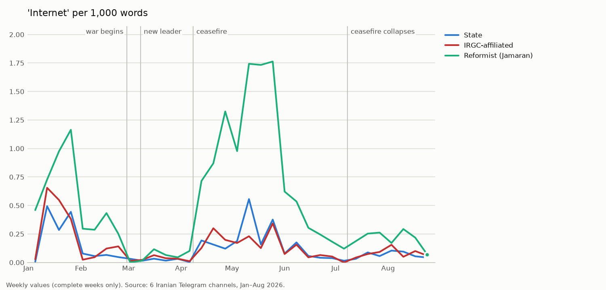
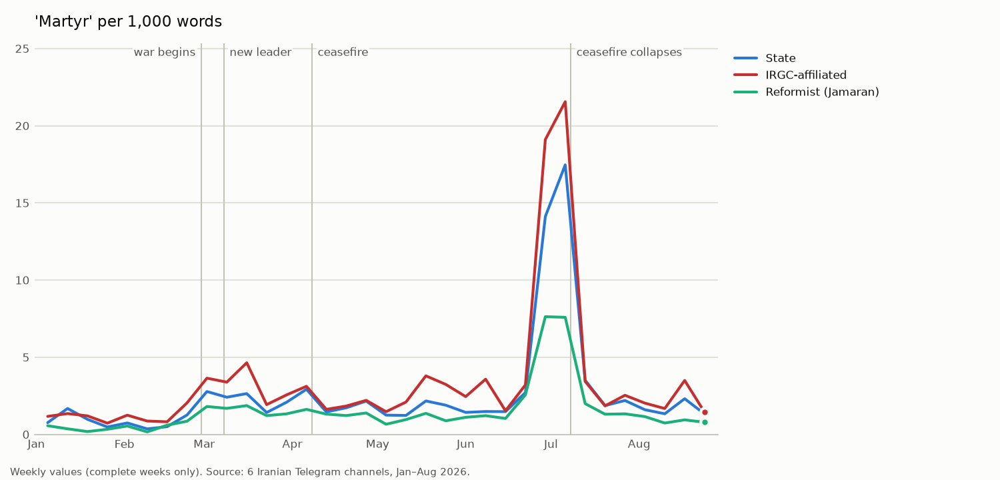
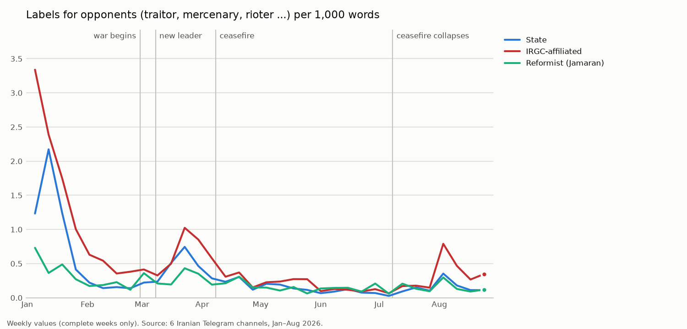
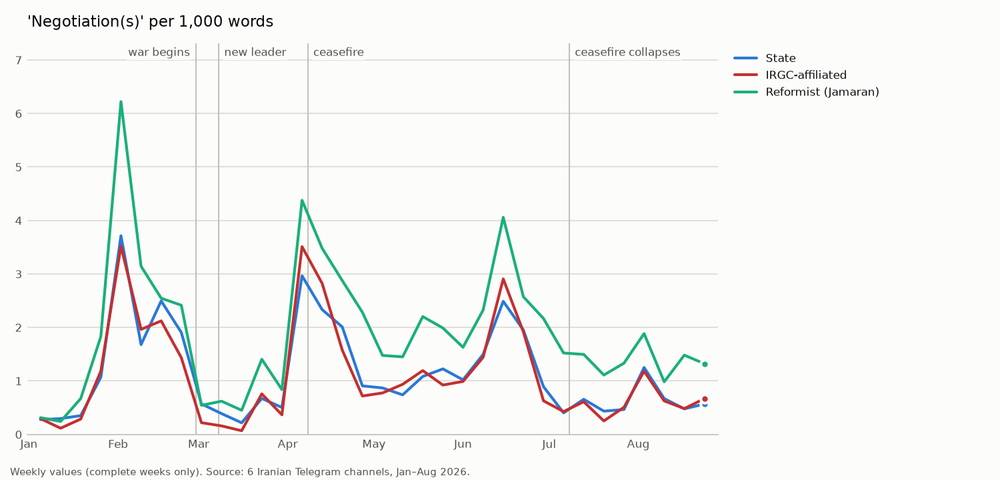
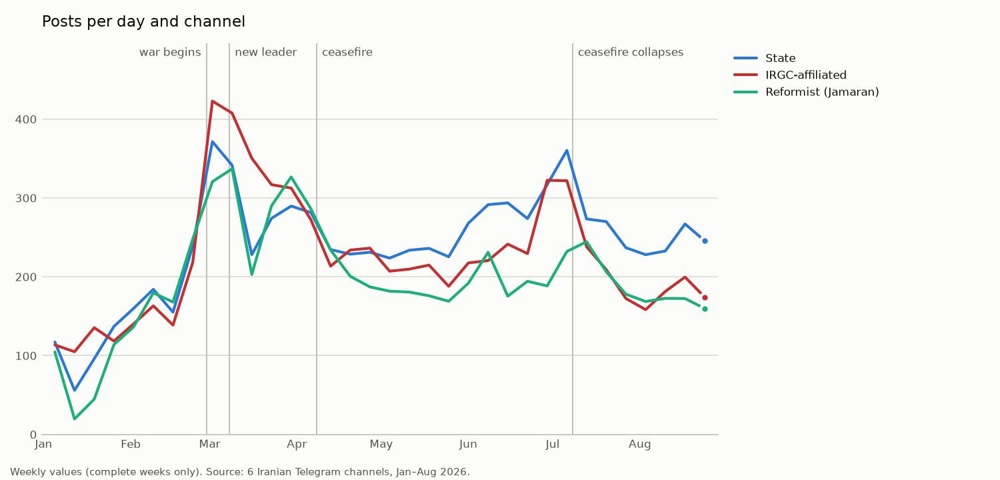

**English** | [Deutsch](../de/04_analyse.md)

# 04 – Analysis: word choice, naming, change over time and reach

[← back to overview](../../README.md)

This page analyses the **complete corpus** – without AI, only with counts and statistics in Python.
The questions: Which words and terms do the three source groups use, how do they name the same actors, how does this
change over time, and how many people do they reach?

The classification by **topic and tone** with AI ([03](03_ai_classification.md)) is a separate step; its analysis
follows after the main run.

| | |
|---|---|
| Basis | 328,330 posts, of which 267,548 with text (cleaned, see [02](02_processing.md)) |
| Unit | frequency **per 1,000 words** – so channels and groups of different size can be compared |
| Time | whole period, four phases (see [02](02_processing.md#phases)) and calendar weeks |
| Results | numbers only, in `results/` – no post texts |
| Status | ✅ complete (word analysis) · ⏳ analysis of the AI classification follows |

---

## Key findings

- **State media** have the profile of an administrative and service agency: provinces, month names, weekdays, heads
  of authorities. **IRGC-affiliated media** are shaped by security, the military and protests (Hezbollah, drone,
  "riots", "rioters"). **Jamaran** reports clearly more on diplomacy, US politics and reformist politicians.
- State and IRGC-affiliated channels increasingly call Israel the "Zionist regime" – after the collapse of the
  ceasefire in **57%** and **53%** of mentions. Jamaran mostly writes "Israel" (**70%**).
- All six channels call Mojtaba Khamenei the Leader for the first time on the day of his official appointment (8 March).
  Even afterwards, about **three quarters** of all mentions of the Leader still concern the killed Ali Khamenei.
- Revenge and opponent labels ("traitor", "mercenary", "rioter") are clearly more frequent in IRGC-affiliated channels –
  opponent labels about **twice as often** as in the other groups. Jamaran mentions Trump most often and most often
  writes "Trump **claims**".
- IRGC-affiliated channels reach about **ten times as many views** per post as state channels and Jamaran, but relative
  to that they are forwarded less often.

---

## 1. From words to fixed terms

### Single words (`01_word_frequency.py`)

The first step counts single words per channel, group and phase. The lists are almost the same in all channels
(ایران, آمریکا, جنگ, مردم …) and have a basic problem: a term such as `رژیم صهیونیستی` ("Zionist regime") is counted
as two words, `رژیم` and `صهیونیستی`.

### Fixed terms (`03_terms.py`)

The script finds fixed terms of two to four words **without a predefined word list** and counts every place in a text
exactly once.

| Rule | Example |
|---|---|
| A word sequence occurs at least 100 times | – |
| Two words: at least 25% of the occurrences of the rarer word are in this sequence | `تنگه هرمز` (Strait of Hormuz) → term |
| Three or four words: at least 25% of both shorter parts are in this sequence | `وزیر امور خارجه` (foreign minister) → term; `حمله رژیم صهیونیستی` (attack by the Zionist regime) → not a term |
| Office words (وزیر, رئیس, سخنگوی …) only as the first word | `عباس عراقچی وزیر امور` → not a term, person and office stay separate |
| In the text the longer term wins; with the same length the more frequent one | `رهبر شهید انقلاب` counts once, not also as `رهبر شهید` or `شهید انقلاب` |

Result: **1,501 fixed terms** (1,490 found automatically, 11 added by the author). `phrases.csv` shows for every term
how often the word sequence occurs in total (`count`) and how often it was actually counted as this term
(`count_used`). Example: `اسلامی ایران` occurs 15,596 times, but almost always inside `جمهوری اسلامی ایران` (Islamic
Republic of Iran), so it is hardly counted on its own.

### Corrections list (`phrase_corrections.csv`)

Automatic rules make mistakes. The author's decisions are kept openly in one file:

| Action | Number | Example |
|---|---|---|
| `title` – office word | 12 | وزیر, رئیس, سخنگوی, فرمانده |
| `add` – long names as one term | 11 | نیروی دریایی سپاه پاسداران انقلاب اسلامی (IRGC Navy, 6 words), وزارت کشور (Ministry of the Interior) |
| `remove` – terms found by mistake | 5 | امور خارجه جمهوری اسلامی (two terms joined) |
| `merge` – spelling and name variants | 56 | سید عباس عراقچی → عراقچی, حاج قاسم → سلیمانی |
| `ignore` – without content, counted but not listed | 263 | channel names, "live", "photo", reporting verbs such as "emphasised", titles without a name |

In addition, 3,824 spellings that differ only by the half-space are merged. Singular and plural stay separate on
purpose: `کشور` (country, often Iran itself) and `کشورهای` (countries, other states) mean different things.

**When is the list finished?** It was checked in several rounds against the result lists. Work stopped when further
corrections no longer changed the findings. The list remains **a decision of the author** – another list would give
slightly different rankings.

### Detours and helper scripts

| Script | What it showed |
|---|---|
| `02_word_pairs.py` | word pairs and triples – counted the same place several times, therefore replaced by 03 |
| `03b_terms_long.py` | test with up to 8 words: longer sequences were almost only chains of person and office → limit of 4 words plus list |
| `04_context.py` | neighbouring words and example sentences for one word, terminal only – to check single terms |
| `05_noise_candidates.py` | suggests words without content for the `ignore` list |

---

## 2. Typical terms per source group (`07_typical_terms.py`)

The most frequent terms are almost the same everywhere. What is revealing is what a group says **clearly more often**
than the others.

**Method:** weighted log-odds ratio with an informative prior ("Fightin' Words", Monroe, Colaresi & Quinn 2008).
Every term gets a z-score; above 1.96 the difference is statistically clear. Rare terms are damped by the prior, so a
word with three occurrences does not end up at the top by chance (minimum frequency 50).

**Every channel must agree:** IRNA has by far the most and longest posts and would otherwise decide on its own what is
"typically state". Therefore every channel of a group is compared with the channels of the other groups; a term only
counts as typical if it is typical for **each** channel of the group. The z-score of the group is the lowest of its
channels.

| Rank | state | z | IRGC-affiliated | z | reformist (Jamaran) | z |
|---|---|---|---|---|---|---|
| 1 | استان (province) | 11.3 | حزب‌الله (Hezbollah) | 20.8 | ترامپ (Trump) | 44.6 |
| 2 | اردیبهشت (month name) | 10.8 | پهپاد (drone) | 15.0 | اینترنت (internet) | 39.1 |
| 3 | بقائی (foreign ministry spokesman) | 9.2 | اغتشاشات ("riots") | 14.2 | ایران | 36.3 |
| 4 | شنبه (Saturday) | 8.4 | صهیونیست‌ها ("the Zionists") | 13.6 | توافق (agreement) | 33.8 |
| 5 | جمهوری اسلامی ایران | 8.2 | ارتش (army) | 13.3 | ایالات متحده (United States) | 32.7 |
| 6 | حسینی | 7.8 | خیابان (street) | 12.7 | مدعی ("claims") | 32.6 |
| 7 | معاون (deputy) | 7.6 | بیعت (oath of allegiance) | 12.5 | مذاکرات (negotiations) | 30.3 |
| 8 | دوشنبه (Monday) | 7.1 | موشک (missile) | 12.4 | جنگ (war) | 29.6 |
| 9 | مدیرکل (director general) | 6.8 | دستگیر (arrested) | 12.4 | سید حسن خمینی | 27.6 |
| 10 | خرداد (month name) | 6.6 | اینترنشنال (Iran International) | 12.0 | خاتمی (Khatami) | 25.7 |

- **State:** administration and services – provinces, calendar, authorities, schools, weather. The z-scores are low:
  the three state channels differ from each other and share little of their own.
- **IRGC-affiliated:** military, security and protests; opponent labels (اغتشاشگران "rioters", ضدانقلاب
  "counter-revolution"), opposition media and persons (Iran International, رضا پهلوی).
- **Jamaran:** diplomacy, US politics and the reformist camp (Hassan Khomeini, Khatami); internet – in January and
  April/May.
- **By phase** (one sheet per group in `typical_terms.xlsx`): IRGC-affiliated before the war "riots", "rioters",
  "counter-revolution"; during the war عبری (Hebrew – quotes from Israeli media) and "oath of allegiance"; after the
  collapse of the ceasefire Saudi Arabia, Yemen, Bahrain, Kuwait. At Jamaran, "internet" ranks first during the ceasefire.

---

## 3. Which Khamenei is meant? (`06_leader_mentions.py`)

`خامنه‌ای` and `رهبر` ("the Leader") can mean Ali Khamenei (killed in the war) or his son and successor Mojtaba
Khamenei. Thousands of posts cannot be read – therefore rules, checked with samples.

| Date (set by the author) | |
|---|---|
| 28 Feb | Ali Khamenei killed |
| 1 Mar | death officially confirmed in Iran (`DEATH_DAY`) |
| 8 Mar | Mojtaba Khamenei officially appointed after the election (`APPOINTMENT_DAY`) |

**Rules:** Mojtaba only with his full name (`سید مجتبی` alone often means other persons); hints to Ali such as
"the martyred Leader", "mourning the Leader", "funeral"; his brothers and other sons are removed first. Until 8 March,
`رهبر` without a name means Ali Khamenei, afterwards Mojtaba, unless the text contains a hint to Ali.

**Check:** A random sample of 50 posts from 1 to 8 March without a name or hint concerned Ali Khamenei in all 50 cases.
Random samples of every category were read; errors found led to new rules. The check file with texts stays private
(`data/check/`).

**Result:**

- All six channels write "رهبر شهید" (the martyred Leader) for the first time on **1 March**.
- All six channels mention Mojtaba Khamenei in one sentence with "Leader" only on **8 March** – **no channel earlier**.
  Jamaran and Mehr name him from 3 March, Tasnim from 5 March – but not yet as the Leader.
- Even after the appointment, most mentions still concern Ali Khamenei:

| Phase | Ali | Mojtaba | both |
|---|---|---|---|
| war (28 Feb – 7 Apr) | 55% | 35% | 10% |
| ceasefire | 74% | 22% | 4% |
| after the collapse of the ceasefire | 79% | 17% | 3% |

All six channels together, 22,897 posts; values per channel in `leader_mentions.xlsx`. The share of Mojtaba is highest
during the war at Fars (45%) and IRIB News (42%).

---

## 4. Naming: what are the same things called? (`08_naming.py`)

Here there is a **predefined list** (`naming_terms.csv`): 108 concepts with 182 spellings in 11 categories, e.g. all
names for Israel. The list is open and can be extended. Only whole words are counted (`اسرائیلی` does not count as
`اسرائیل`); within a category the longest form comes first.

### Israel

Share of all names for Israel:

| | state | IRGC-affiliated | Jamaran |
|---|---|---|---|
| **رژیم صهیونیستی** ("Zionist regime"), whole period | 48% | 40% | 29% |
| – before the war | 46% | 40% | 28% |
| – war | 42% | 35% | 31% |
| – ceasefire | 48% | 40% | 29% |
| – after the collapse of the ceasefire | **57%** | **53%** | 26% |
| **اسرائیل** ("Israel"), whole period | 45% | 50% | **65%** |

State and IRGC-affiliated channels use "Zionist regime" clearly more often after 8 July, Jamaran does not.
IRGC-affiliated channels also write `صهیونیست‌ها` ("the Zionists", 6%) and `فلسطین اشغالی` ("occupied Palestine" for
Israeli territory, 10% compared with 3% at Jamaran) more often.

### USA

`آمریکا` is the main name everywhere (76–84%). Jamaran writes the formal name `ایالات متحده` ("United States") more
often (11% compared with 7% and 5%). Pejorative names such as `ارتش تروریستی آمریکا` ("terrorist army of America")
increase in all groups after the collapse of the ceasefire (to about 3%).

### Persons, diplomacy, revenge, opponents

Per 1,000 words:

| | state | IRGC-affiliated | Jamaran |
|---|---|---|---|
| Trump | 1.86 | 2.06 | **3.11** |
| Ghalibaf (speaker of parliament) | 0.23 | **0.32** | 0.27 |
| Baghaei (foreign ministry spokesman) | **0.28** | 0.14 | 0.13 |
| Khatami | 0.01 | 0.02 | **0.12** |
| Zarif | 0.01 | 0.01 | **0.06** |
| Diplomacy (negotiations, agreement, ceasefire, peace …) | 3.88 | 3.04 | **5.39** |
| Revenge (انتقام, خونخواهی, قصاص …) | 0.20 | **0.32** | 0.12 |
| Labels for opponents (traitor, mercenary, rioter …) | 0.25 | **0.48** | 0.22 |
| Crimes (genocide, child-killer, war crimes …) | **1.03** | 0.90 | 0.75 |

### Words next to Trump and Netanyahu

| Word directly after "Trump" | state | IRGC-affiliated | Jamaran |
|---|---|---|---|
| مدعی ("claims") | 2.8% | 3.0% | **8.2%** |
| جنایتکار ("criminal") | 0.5% | **1.4%** | – |
| قمارباز ("gambler") | – | 0.6% | – |

"–" = not among the 20 most frequent neighbouring words. Jamaran frames Trump's statements as claims; IRGC-affiliated
channels more often use personal insults. Full lists in `neighbours.csv`.

---

## 5. Change over time (`09_timeline.py`)

The same terms per **calendar week**. Every point is the value of one week, not a running total. The first and the
last week are incomplete (data from 1 January, or only 31 August) and are therefore left out of the charts, but they
are in `timeline.csv`. Vertical lines mark the start of the war (28 Feb), the new Leader (8 Mar), the ceasefire
(8 Apr) and the collapse of the ceasefire (8 Jul).

| Chart | What it shows |
|---|---|
|  | "Internet" almost only at Jamaran, with peaks in January and from April to May |
|  | "Martyr": a strong peak at the end of June / beginning of July, highest in IRGC-affiliated channels (21.6 per 1,000 words) |
|  | opponent labels most frequent in January (protests), above all IRGC-affiliated |
|  | "Negotiations": peaks in early February, early April and mid-June; Jamaran almost always highest |

More charts: [ceasefire](../../results/timeline/charts/ceasefire.png) ·
[revenge](../../results/timeline/charts/revenge.png) ·
[crimes](../../results/timeline/charts/crimes.png) ·
[Trump](../../results/timeline/charts/trump.png) ·
[Ghalibaf](../../results/timeline/charts/ghalibaf.png) ·
["United States"](../../results/timeline/charts/usa_united_states_share.png)

---

## 6. Activity and reach (`10_activity.py`)

| | state | IRGC-affiliated | Jamaran |
|---|---|---|---|
| Posts per day and channel | 237 | 222 | 195 |
| Views per post (median) | 1,259 | **11,858** | 1,593 |
| Forwards per post (median) | 5 | **18** | 5 |
| Forwards per 1,000 views | **5.1** | 2.1 | 4.2 |

- **Activity:** With the start of the war the number of posts doubles to triples (from about 130 to 300–420 per day and
  channel); a second peak in early July.
- **Reach:** Tasnim and Fars reach about ten times as many views per post. This depends mainly on the number of
  subscribers, which was not collected – it describes reach, not quality.
- With the start of the war, views per post fall in all groups, at Jamaran from 3,329 to 969 (median), although more is
  posted. Possible reasons – more posts for the same readers, restricted internet access – cannot be separated with
  these data.
- **Forwards relative to views:** posts of state channels and Jamaran are forwarded about twice as often per view as
  those of IRGC-affiliated channels.

More charts: [views](../../results/activity/charts/views_median.png) ·
[forwards per 1,000 views](../../results/activity/charts/forwards_per_1000_views.png)

---

## 7. Limitations

- **Counting is not understanding.** The counts do not see context: negation, quotation or irony count the same.
  Whether a term is used approvingly or at a distance is only shown by the AI classification or by reading.
- **Decisions of the author:** corrections list, naming list, phase and event dates. They are documented openly; other
  decisions would give slightly different numbers.
- **Rules checked with samples,** not every post read (Leader assignment, cleaning).
- **Different channel profiles:** state channels publish a lot of service and administrative content, which lowers their
  share of political terms per 1,000 words.
- **Views and forwards** are the numbers at the time of collection; subscriber numbers are missing.
- **No network analysis:** for forwarded posts only the sender name was saved during collection, which is usually empty
  for channels (96 of 328,330 posts). Who forwards whom can therefore not be analysed.
- **Gaps in January:** IRNA and Jamaran hardly posted in mid-January (internet shutdown in Iran, see
  [01](01_data_collection.md)).
- The "reformist" group consists of **one channel**.

---

## 8. Files

| Script | Purpose | Result (`results/`) |
|---|---|---|
| `scripts/analysis/01_word_frequency.py` | most frequent single words | `words/word_frequency.*` |
| `scripts/analysis/02_word_pairs.py` | word pairs (intermediate step) | – |
| `scripts/analysis/03_terms.py` | fixed terms, every place counted once | `words/phrases.csv`, `words/terms.*` |
| `scripts/analysis/03b_terms_long.py` | test with up to 8 words | – |
| `scripts/analysis/04_context.py` | neighbouring words and examples (terminal) | – |
| `scripts/analysis/05_noise_candidates.py` | suggestions for the `ignore` list | – |
| `scripts/analysis/06_leader_mentions.py` | Ali or Mojtaba Khamenei | `leader/leader_mentions.*` |
| `scripts/analysis/07_typical_terms.py` | typical terms (log-odds) | `words/typical_terms.*` |
| `scripts/analysis/08_naming.py` | naming, neighbouring words | `naming/naming.*`, `naming/neighbours.csv` |
| `scripts/analysis/09_timeline.py` | weekly change, charts | `timeline/timeline.*`, `timeline/charts/` |
| `scripts/analysis/10_activity.py` | activity and reach | `activity/*`, `activity/charts/` |
| `scripts/analysis/phrase_corrections.csv` | the author's corrections list | – |
| `scripts/analysis/naming_terms.csv` | list of names | – |

Order: `03` → `07` → `06` → `08` → `09` → `10`. Technology: Python 3.11, `pandas`, `numpy`, `matplotlib`, `SQLAlchemy`.
Description of all result files: [results/README.md](../../results/README.md).
